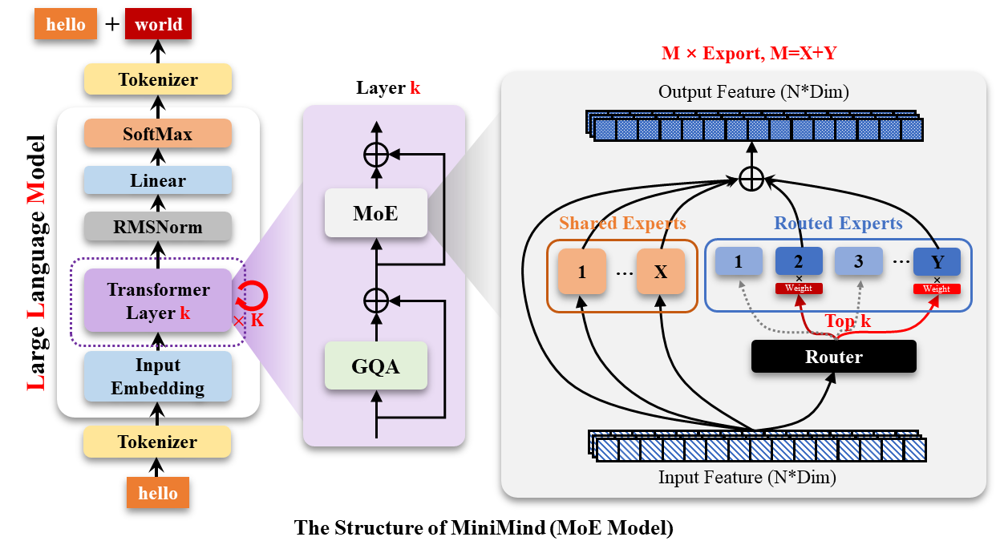
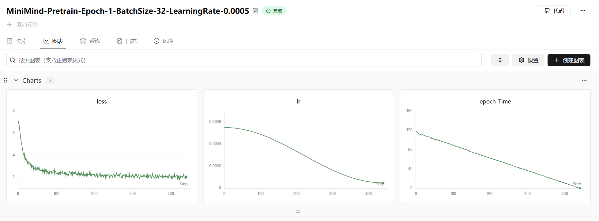

## 10. MoE



### 10.1 MoEGate

实现了一个 **混合专家模型（MoE, Mixture of Experts）** 中的核心组件——**门控网络（Gating Network）**，类名为 `MoEGate`。

它的主要作用是：接收输入（hidden states），决定每个 token 应该由哪些“专家”（Experts）来处理，并计算用于负载均衡的辅助损失（Auxiliary Loss）。

下面我将详细拆解代码的各个部分：

#### 1. 初始化 (`__init__`)

这里定义了门控网络所需的超参数和权重。

*   `top_k`: 每个 token 选择多少个专家（例如 top-2）。
*   `n_routed_experts`: 总共有多少个专家可供选择。
*   `scoring_func`: 评分函数，这里只实现了 `'softmax'`。
*   `alpha` & `seq_aux`: 用于计算辅助损失的系数和模式。
*   `norm_topk_prob`: 是否对选中的 top-k 专家的权重进行归一化（使其和为1）。
*   **`self.weight`**: 这是一个形状为 `(n_experts, hidden_size)` 的线性层权重。它将输入向量映射到每个专家的打分上。

#### 2. 前向传播 (`forward`)

这是核心逻辑所在，主要分为三个步骤：

##### 第一步：计算路由得分 (Routing Scores)

```python
bsz, seq_len, h = hidden_states.shape
hidden_states = hidden_states.view(-1, h)              # 展平 batch 和 seq 维度
logits = F.linear(hidden_states, self.weight, None)    # 线性投影: [tokens, n_experts]
if self.scoring_func == 'softmax':
    scores = logits.softmax(dim=-1)                    # 归一化为概率
```

*   将输入展平，把所有 token 一视同仁。
*   通过线性层计算每个 token 对每个专家的原始分数（logits）。
*   使用 Softmax 将分数转换为概率分布。

##### 第二步：选择专家 (Top-K Selection)

```python
topk_weight, topk_idx = torch.topk(scores, k=self.top_k, dim=-1, sorted=False)

if self.top_k > 1 and self.norm_topk_prob:
    denominator = topk_weight.sum(dim=-1, keepdim=True) + 1e-20
    topk_weight = topk_weight / denominator
```

*   `torch.topk`: 选出概率最高的 `top_k` 个专家。
    *   `topk_idx`: 选中专家的索引。
    *   `topk_weight`: 选中专家的原始概率权重。
*   **归一化**: 如果配置开启，将选中的这 k 个专家的权重除以它们的和，使得这 k 个权重的总和为 1。这有助于保持后续数值的稳定性。

##### 第三步：计算辅助损失 (Auxiliary Loss / Load Balancing Loss)

这是 MoE 中非常关键的一步。如果不加限制，门控网络往往会陷入“坍塌”模式，即把所有 token 都发给同一个或某几个特定的专家，导致其他专家闲置。辅助损失通过惩罚不均衡的分配来强制负载均衡。

代码中有两种计算方式：

**情况 A: 序列级辅助损失 (`seq_aux=True`)**

```python
if self.seq_aux:
    scores_for_seq_aux = scores_for_aux.view(bsz, seq_len, -1)
    ce = torch.zeros(bsz, self.n_routed_experts, device=hidden_states.device)
    # 统计每个样本（Sequence）中，每个专家被选中的次数
    ce.scatter_add_(1, topk_idx_for_aux_loss, torch.ones(...)) 
    # 计算损失
    aux_loss = (ce * scores_for_seq_aux.mean(dim=1)).sum(dim=1).mean() * self.alpha
```

*   这种模式关注的是**单个序列内部**的负载均衡。它计算每个序列中专家被选中的频率分布，并结合该序列对专家的平均打分来计算损失。

**情况 B: Batch 级辅助损失 (`seq_aux=False`) —— 经典方式**
这是 Switch Transformer 或 GShard 论文中标准的负载均衡损失。

```python
else:
    mask_ce = F.one_hot(topk_idx_for_aux_loss.view(-1), num_classes=self.n_routed_experts)
    ce = mask_ce.float().mean(0)      # f_i: 实际上有多少 token 被分配给了专家 i (Fraction)
    Pi = scores_for_aux.mean(0)       # P_i: 门控网络给专家 i 的平均概率 (Probability)
    fi = ce * self.n_routed_experts
    aux_loss = (Pi * fi).sum() * self.alpha
```

*   **原理**: 我们希望“门控网络预测的概率分布 $P$”和“实际的分配分布 $f$”都是均匀的。
*   `ce` ($f_i$): 实际被选中的频率。如果某个专家被选得太多，这个值就大。
*   `Pi` ($P_i$): 平均预测概率。
*   `aux_loss` $\propto \sum (f_i \times P_i)$。最小化这个点积意味着鼓励均匀分布（当分布最不均匀时，比如都集中在一点，点积最大；当分布均匀时，点积最小）。

#### 3. 返回值

```python
return topk_idx, topk_weight, aux_loss
```

1.  **`topk_idx`**: 告诉后面的层，每个 token 应该被送到哪几个专家那里计算。
2.  **`topk_weight`**: 告诉后面的层，专家计算出的结果应该按什么比例加权融合。
3.  **`aux_loss`**: 这个损失值会被加到最终的总 Loss 中参与反向传播，更新门控网络的参数 `self.weight`，从而让它学会更均衡地分配任务。

#### 总结

`MoEGate` 是 MoE 架构的“交通指挥官”。它不仅负责根据输入特征智能地将数据分流给最合适的专家（Expert），还通过内部计算的辅助损失（Aux Loss）来自我约束，防止造成“交通拥堵”（某些专家过载，某些专家闲置）。

### 10.2 举例解释 MoEGate

为了让你清晰理解 `MoEGate` 的工作流程，我们将设定一个具体的**场景**，并跟踪数据在每一步的数值变化和维度变化。

#### 1. 场景设定 (Scenario Setup)

假设我们有一个微型的 MiniMind 模型配置：

*   **Batch Size (`bsz`)**: 2 (两句话)
*   **Sequence Length (`seq_len`)**: 3 (每句话 3 个 token)
*   **Hidden Size (`h`)**: 4 (每个 token 用 4 维向量表示)
*   **总专家数 (`n_routed_experts`)**: 4 (专家 E0, E1, E2, E3)
*   **Top-K (`top_k`)**: 2 (每个 token 选 2 个专家)

---

#### 2. 前向传播过程详解

##### 第一步：输入变形与打分 (Flatten & Linear)

**输入 (`hidden_states`)**:

*   **维度**: `(2, 3, 4)`  -> `[bsz, seq_len, h]`
*   **含义**: 2句话，每句3个词，每个词是4维向量。

**代码操作**:

```python
hidden_states = hidden_states.view(-1, h)
logits = F.linear(hidden_states, self.weight, None)
scores = logits.softmax(dim=-1)
```

**过程解析**:

1.  **展平 (View)**: 为了统一处理所有 token，我们将 Batch 和 Seq 维度合并。
    *   **维度变化**: `(2, 3, 4)` -> **`(6, 4)`**  (共有 6 个 token)。
2.  **打分 (Linear)**: 门控网络权重 `self.weight` 维度为 `(4, 4)` `[n_experts, h]`。
    *   计算 `Input @ Weight.T`。
    *   **维度变化**: `(6, 4)` x `(4, 4)^T` -> **`(6, 4)`**。
    *   这里的 `(6, 4)` 意味着：6 个 token，每个 token 对 4 个专家的原始打分。
3.  **概率 (Softmax)**: 将打分转为概率，和为 1。

**举例 (Token 0 的数据)**:
假设第 1 个 token 对 4 个专家的 `scores` 为：
`[0.1, 0.6, 0.2, 0.1]` (分别对应 E0, E1, E2, E3)

---

##### 第二步：选出 Top-K 专家 (Routing)

**代码操作**:

```python
topk_weight, topk_idx = torch.topk(scores, k=self.top_k, dim=-1, sorted=False)
```

**过程解析**:

*   我们设定 `k=2`，所以选出概率最大的两个。
*   **维度变化**: `scores` 是 `(6, 4)` -> `topk` 输出都是 **`(6, 2)`**。

**举例 (Token 0 的数据)**:

*   **原始分数**: `[0.1, 0.6, 0.2, 0.1]`
*   **`topk_idx` (索引)**: `[1, 2]` (选中了 E1 和 E2)
*   **`topk_weight` (权重)**: `[0.6, 0.2]`

---

##### 第三步：权重归一化 (Normalization)

**代码操作**:

```python
if self.top_k > 1 and self.norm_topk_prob:
    denominator = topk_weight.sum(dim=-1, keepdim=True) + 1e-20
    topk_weight = topk_weight / denominator
```

**过程解析**:

*   为了让后续计算加权平均时比例正确，通常会将选中的权重重新归一化，使其和为 1。
*   **维度**: 保持 **`(6, 2)`** 不变。

**举例 (Token 0 的数据)**:

*   选中权重: `[0.6, 0.2]`
*   求和: $0.6 + 0.2 = 0.8$
*   **新权重**: `[0.6/0.8, 0.2/0.8]` -> **`[0.75, 0.25]`**
*   *含义: 最终专家的输出结果，E1 的结果占 75%，E2 的结果占 25%。*

---

##### 第四步：计算辅助损失 (Auxiliary Loss)

<font color=purple>1. 公共预处理 (Common Preparation)</font>

首先，无论使用哪种 Loss 计算方式，都会进行以下数据准备：

```python
scores_for_aux = scores                    # 维度: (6, 4)
topk_idx_for_aux_loss = topk_idx.view(bsz, -1) 
# topk_idx 原本是 (6, 2)
# view(2, -1) -> 变成 (2, 6)
```

**维度解释**:
这里的 `(2, 6)` 代表：

*   **第 1 行 (Seq A)**: 包含了 Seq A 中 3 个 Token 分别选出的共 6 个专家索引。
*   **第 2 行 (Seq B)**: 包含了 Seq B 中 3 个 Token 分别选出的共 6 个专家索引。

**举例**:

*   Seq A 的索引: `[1, 2,  1, 3,  0, 1]` (E1被选中3次, E2/E3/E0各1次)
*   Seq B 的索引: `[2, 3,  2, 3,  2, 3]` (E2/E3各被选中3次)

---

<font color=purple>2. 分支一：`seq_aux=False` (Batch 级负载均衡)</font>

这是最经典、最常用的 MoE Loss 计算方式（Switch Transformer, DeepSeekMoE 等多用此类逻辑的变体）。它的核心思想是：**在整个 Batch 范围内，专家被选中的频率应该接近其被预测的概率，且尽量均匀。**

```python
else:
    # 1. 展平所有索引，制作 One-Hot
    # topk_idx_for_aux_loss.view(-1) -> (12,)  [共有12次选择机会]
    mask_ce = F.one_hot(topk_idx_for_aux_loss.view(-1), num_classes=self.n_routed_experts)
    # mask_ce 维度: (12, 4)
    
    # 2. 计算实际选中频率 f_i (ce)
    ce = mask_ce.float().mean(0)
    # 维度变化: (12, 4) -> mean(dim=0) -> (4,)
    
    # 3. 计算平均预测概率 P_i
    Pi = scores_for_aux.mean(0)
    # scores_for_aux 维度: (6, 4) -> mean(dim=0) -> (4,)

    # 4. 计算最终 Loss
    fi = ce * self.n_routed_experts
    aux_loss = (Pi * fi).sum() * self.alpha
```

**维度与数值过程**:

1.  **`mask_ce` (12, 4)**:
    *   把刚才 Seq A 和 Seq B 的所有索引拼起来：`[1, 2, 1, 3, 0, 1, 2, 3, 2, 3, 2, 3]`。
    *   转成 One-Hot。例如第一个 `1` 变成 `[0, 1, 0, 0]`。

2.  **`ce` (4,)**:
    *   统计每列的平均值（即频率）。
    *   总数 12。
    *   E0 出现 1 次 -> 1/12 ≈ 0.083
    *   E1 出现 3 次 -> 3/12 = 0.25
    *   E2 出现 4 次 -> 4/12 ≈ 0.333
    *   E3 出现 4 次 -> 4/12 ≈ 0.333
    *   **Result `ce`**: `[0.083, 0.25, 0.333, 0.333]`

3.  **`fi` (4,)**:
    *   为了让数值更有物理意义（归一化到 1 附近），乘以专家数 4。
    *   **Result `fi`**: `[0.33, 1.0, 1.33, 1.33]`。
    *   *解释*: E2 和 E3 是“过载”的（大于1），E0 是“闲置”的（小于1）。

4.  **`Pi` (4,)**:
    *   计算模型对每个专家的平均打分。假设模型很均匀，`[0.25, 0.25, 0.25, 0.25]`。

5.  **`aux_loss` (Scalar)**:
    *   点积 `Sum(Pi * fi)`。
    *   如果分布极度不均（比如全选E2），Loss 会很大；如果分布均匀，Loss 最小。

---

<font color=purple>3. 分支二：`seq_aux=True` (Sequence 级负载均衡)</font>

这种方式要求更严格：**不仅仅整个 Batch 要均衡，每个单独的序列（Sequence）内部也要均衡**。这通常用于更细粒度的控制。

```python
if self.seq_aux:
    # 1. 恢复 Seq 维度
    scores_for_seq_aux = scores_for_aux.view(bsz, seq_len, -1)
    # 维度: (2, 3, 4) [Batch, Seq, Experts]

    # 2. 初始化计数器
    ce = torch.zeros(bsz, self.n_routed_experts, device=hidden_states.device)
    # 维度: (2, 4) [Batch, Experts] -> 用来存每个序列选了每个专家多少次
    
    # 3. 填充计数器 (scatter_add)
    # topk_idx_for_aux_loss 维度: (2, 6)
    # 这里的 6 是 seq_len * top_k
    ce.scatter_add_(1, topk_idx_for_aux_loss,
                    torch.ones(bsz, seq_len * aux_topk, device=hidden_states.device))
    # 操作解释: 在 dim=1 上，根据 index 把 1.0 加进去。
    # 维度: (2, 4) 保持不变

    # 4. 归一化计数
    ce.div_(seq_len * aux_topk / self.n_routed_experts)
    # 维度: (2, 4)
    
    # 5. 计算 Loss
    # scores_for_seq_aux.mean(dim=1) -> (2, 4) [每个序列对专家的平均打分]
    aux_loss = (ce * scores_for_seq_aux.mean(dim=1)).sum(dim=1).mean() * self.alpha
```

**维度与数值过程**:

1. **`ce` (2, 4) 的填充**:

   * **Row 0 (Seq A)**: 索引 `[1, 2, 1, 3, 0, 1]`。

     *   E0+1, E1+3, E2+1, E3+1。
     *   Row 0 变成: `[1, 3, 1, 1]`。

   * **Row 1 (Seq B)**: 索引 `[2, 3, 2, 3, 2, 3]`。

     *   E2+3, E3+3。
     *   Row 1 变成: `[0, 0, 3, 3]`。

   * **Current `ce`**:

     ```text
     [[1, 3, 1, 1],
      [0, 0, 3, 3]]
     ```

2. **`ce` 的归一化**:

   * 除数因子: $3 (\text{len}) \times 2 (\text{topk}) / 4 (\text{experts}) = 1.5$。

   * 这是“期望值”。如果完全均衡，每个专家应该被选 1.5 次。

   * **Result `ce`**:

     ```text
     [[0.66, 2.0, 0.66, 0.66],  <- Seq A: E1 严重过载(2.0)
      [0.0,  0.0, 2.0, 2.0 ]]   <- Seq B: E2, E3 严重过载
     ```

3. **计算 Loss**:

   *   `scores_for_seq_aux.mean(dim=1)`: 维度 `(2, 4)`。计算 Seq A 和 Seq B 各自对专家的平均打分概率。
   *   与 `ce` 进行**逐元素相乘 (Element-wise Multiply)**。
   *   `sum(dim=1)`: 对 Expert 维度求和 -> 得到 `(2,)`，即 Seq A 的 Loss 和 Seq B 的 Loss。
   *   `mean()`: 对 Batch 维度求平均 -> 得到最终标量 Loss。

<font color=purple>总结区别</font>

| 特性         | `seq_aux=False` (Batch Level)                                | `seq_aux=True` (Sequence Level)                              |
| :----------- | :----------------------------------------------------------- | :----------------------------------------------------------- |
| **关注点**   | 只要这一批数据总量分配均匀即可。允许 Seq A 全用 E1，Seq B 全用 E2。 | 要求 Seq A 内部必须均匀（E0~E3都得用），Seq B 内部也必须均匀。 |
| **计算维度** | 压缩 Batch 维度，统计全局直方图。                            | 保留 Batch 维度 `(B, N_Experts)`，分别统计直方图。           |
| **严厉程度** | 较宽松。                                                     | 较严格（有时候过于严格可能影响特定任务的专家专业化）。       |
| **核心操作** | `one_hot` + `mean(0)`                                        | `scatter_add` + `mean(1)`                                    |

---

#### 3. 输出总结 (Outputs)

函数最终返回三个值，它们的维度如下：

1.  **`topk_idx`**: 维度 **`(6, 2)`** (即 `[bsz * seq_len, top_k]`)
    *   *解释*: 告诉后续的 MoE Layer，这 6 个 token 分别应该送到哪 2 个专家的 CUDA 核上去计算。

2.  **`topk_weight`**: 维度 **`(6, 2)`**
    *   *解释*: 告诉后续的 MoE Layer，拿回专家的计算结果后，按什么比例融合。例如 Token 0 的结果 = $0.75 \times E_1(x) + 0.25 \times E_2(x)$。

3.  **`aux_loss`**: 标量 (Scalar)
    *   *解释*: 一个浮点数，比如 `0.0025`。这个值会加到总 Loss 里，强迫 `self.weight` 在下一轮更新时，给那些没人选的专家（E0, E3）多一点分数，给太忙的专家（E1, E2）少一点分数。

### 10.3 MoEFeedForward

**包含共享专家（Shared Experts）和路由专家（Routed Experts）的混合专家前馈网络层（MOE FeedForward）** 。

它的核心逻辑分为两部分：

1.  **训练模式 (`forward` 中的 if)**：使用掩码（Mask）和张量复制的方式并行计算，代码逻辑简单但显存占用较高。
2.  **推理模式 (`moe_infer`)**：使用排序和分组索引的方式计算，避免无效计算，速度更快。

我们将继续使用之前的场景来拆解：

*   **Batch Size (`bsz`)**: 2
*   **Seq Len (`seq_len`)**: 3
*   **Hidden Size (`h`)**: 4
*   **Experts (`n_routed`)**: 4 (E0, E1, E2, E3)
*   **Top-K (`k`)**: 2 (每个 token 选 2 个专家)
*   **Shared Experts**: 假设有 1 个共享专家 (S0)

---

#### 1. 初始化 (`__init__`)

*   `self.experts`: 4 个独立的 `FeedForward` 网络（E0~E3）。
*   `self.gate`: 上文解释过的门控网络。
*   `self.shared_experts`: 1 个共享的 `FeedForward` 网络（S0），它是所有 Token 必经之路（类似 DeepSeekMoE 架构）。

---

#### 2. 前向传播 (`forward`)

##### Step 1: 门控与变形

```python
bsz, seq_len, _ = x.shape  # x: [2, 3, 4]
topk_idx, topk_weight, aux_loss = self.gate(x)
# topk_idx: [2, 3, 2] -> 展平后 [6, 2]
# topk_weight: [2, 3, 2] -> 展平后 [6, 2]

x = x.view(-1, x.shape[-1])       # x: [6, 4] (6个token)
flat_topk_idx = topk_idx.view(-1) # flat_topk_idx: [12] (6个token * 2次选择)
```

---

##### Step 2: 训练模式 (Training Path)

训练时为了并行效率，采用“空间换时间”策略。

**核心代码**:

```python
if self.training:
    # 1. 复制输入
    x = x.repeat_interleave(self.config.num_experts_per_tok, dim=0)
    # 2. 准备输出容器
    y = torch.empty_like(x, dtype=x.dtype)
    # 3. 遍历专家计算
    for i, expert in enumerate(self.experts):
        y[flat_topk_idx == i] = expert(x[flat_topk_idx == i])
    # 4. 加权融合
    y = (y.view(*topk_weight.shape, -1) * topk_weight.unsqueeze(-1)).sum(dim=1)
```

**维度与数值演变详解**:

1.  **`repeat_interleave`**:
    *   因为每个 Token 要被送进 2 个专家，我们把输入数据复制 2 份。
    *   原 `x`: `[T0, T1, ... T5]` (6个)
    *   新 `x`: `[T0, T0, T1, T1, ... T5, T5]` (12个)
    *   **维度变化**: `[6, 4]` -> **`[12, 4]`**。

2.  **遍历专家 (`for i, expert`)**:
    *   `flat_topk_idx` (长度12) 记录了这 12 个位置分别应该由谁处理。
    *   假设 `flat_topk_idx = [1, 2, 0, 3, ...]` (T0选E1,E2; T1选E0,E3...)。
    *   **当 `i=0` (专家E0)**:
        *   Mask: `[F, F, T, F, ...]` (找出所有分配给 E0 的位置)。
        *   `x[mask]`: 挑出分配给 E0 的输入向量。
        *   `expert(x[mask])`: 计算结果。
        *   `y[mask] = ...`: 填回 `y` 的对应位置。
    *   循环结束后，`y` (12, 4) 被填满，包含了所有专家计算出的结果片段。

3.  **加权融合**:
    *   `y.view(*topk_weight.shape, -1)`: 把 `y` 从 `[12, 4]` 变回 **`[6, 2, 4]`**。
        *   现在 dim=1 的两个位置分别是 Top-1 专家和 Top-2 专家的输出。
    *   `topk_weight.unsqueeze(-1)`: 权重维度 `[6, 2, 1]`。
    *   相乘并 `sum(dim=1)`:
        *   $Result = w_1 \cdot E_{idx1}(x) + w_2 \cdot E_{idx2}(x)$。
    *   **维度变化**: `[6, 2, 4]` -> **`[6, 4]`**。

---

##### Step 3: 推理模式 (`moe_infer`)

推理时不求梯度，且 Batch 可能较小，为了减少显存和无效计算，使用索引排序法。

**核心代码**:

```python
else:
    y = self.moe_infer(x, flat_topk_idx, topk_weight.view(-1, 1)).view(*orig_shape)
```

我们深入 `moe_infer` 函数：

```python
# x: [6, 4] (原始6个token)
# flat_expert_indices: [12] (例如 [1, 2, 0, 3, 1, 3...])

# 1. 排序
idxs = flat_expert_indices.argsort() 
# 假设排序后 idxs = [2, 10,  0, 4, 8,  1, 6, ...] 
# 意思是：第2号任务是E0的，第10号任务也是E0的...

# 2. 确定每个专家的任务边界
tokens_per_expert = flat_expert_indices.bincount().cumsum(0)
# 假设 E0有两个任务，E1有三个... -> cumsum -> [2, 5, ...]

# 3. 映射回原 Token ID
token_idxs = idxs // self.config.num_experts_per_tok
# idxs 里的值范围是 0~11。
# 0和1属于Token0，2和3属于Token1...
# 所以除以2 (k=2) 就能知道这个任务属于哪个原始 Token。
```

**推理循环 (`for loop`)**:

*   我们不再遍历所有数据，而是按专家分段处理。
*   **E0 的回合**:
    *   拿到 E0 负责的所有任务的排序索引 `idxs[0:2]`。
    *   找到对应的原始 Token ID `token_idxs[0:2]`。
    *   取数据: `expert_tokens = x[exp_token_idx]`。注意这里 `x` 没被复制扩大，是直接从原图 `[6, 4]` 里取。
    *   计算: `out = expert(tokens)`。
    *   **加权**: `out.mul_(weight)`.
    *   **累加回原位**: `expert_cache.scatter_add_(...)`。
        *   因为 Token 0 可能同时被 E0 和 E1 处理，这里利用 `scatter_add` 将 E0 的加权结果加到 Token 0 的位置上，等会儿 E1 算完了再加进去。

**维度变化**:

*   `expert_cache`: 初始化 `[6, 4]` (全0)。
*   不断把各个专家的结果加进去。
*   最终返回 `[6, 4]`。

---

##### Step 4: 共享专家 (Shared Experts)

```python
if self.config.n_shared_experts > 0:
    for expert in self.shared_experts:
        y = y + expert(identity)
```

*   `identity` 是最开始的输入 `x` `[2, 3, 4]`。
*   共享专家直接对全量数据进行处理，不走路由。
*   结果直接相加（Residual Connection）。
*   **维度**: `y` 保持 `[2, 3, 4]`。

#### 总结图解 (Dimensions)

**Scenario**: B=2, L=3, H=4, K=2. Total Tokens=6.

```text
Input x: [2, 3, 4]
   |
   v View
[6, 4]
   |
   +----> Gate ---> TopK Indices [6, 2], Weights [6, 2]
   |
   | (Training Branch)
   +----> Repeat Interleave (K=2)
   |      x_expanded: [12, 4]
   |
   +----> Loop Experts (Masking)
   |      Calulate only matching rows
   |      y_expanded: [12, 4]
   |
   +----> View & Weighted Sum
   |      [6, 2, 4] * [6, 2, 1] -> Sum -> [6, 4]
   |
   | (Shared Experts)
   +----> + Shared_Expert(x)
   |
   v Reshape
Output: [2, 3, 4]
```

#### 为什么推理逻辑里 `token_idxs = idxs // k` 是对的？

这是一个很巧妙的索引设计。

1.  `flat_topk_idx` 是把 `(Batch, Seq, K)` 展平得到的。
2.  顺序是：`Token0_K0`, `Token0_K1`, `Token1_K0`, `Token1_K1`, ...
3.  索引位置 0 和 1 对应 Token 0。
4.  索引位置 2 和 3 对应 Token 1。
5.  ...
6.  索引位置 $m$ 对应 Token $\lfloor m / K \rfloor$。

所以在推理时，虽然我们将所有任务按专家重新排序打乱了（`argsort`），但只要拿着排序后的索引值除以 $K$，就能立刻知道“这个任务原本是属于第几个 Token 的”。这使得我们可以直接从原始 `x` 中 `gather` 数据，而不需要像训练时那样预先 `repeat_interleave` 显存爆炸。

### 实验结果

