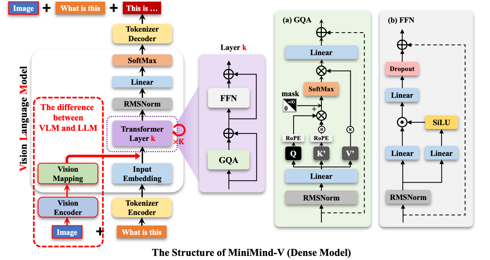
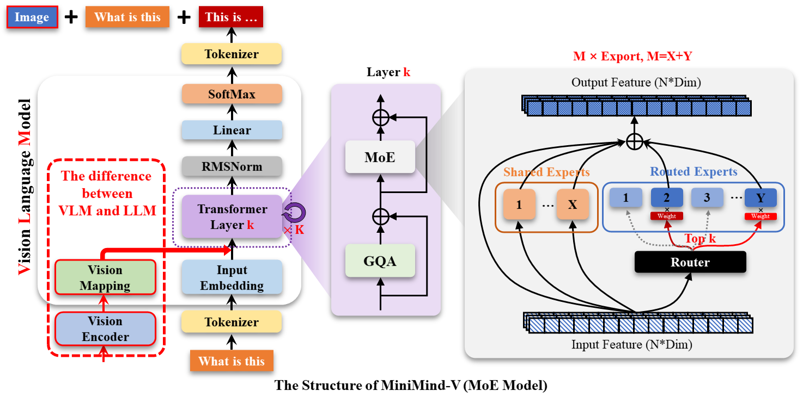

# minimind-v





## 1. `model_vlm.py` 解析

这个脚本实现了一个**视觉-语言模型（VLM）**，其核心思想是：**将图像特征作为特殊的“词向量”插入到文本序列中，输入给大语言模型（LLM）去理解。**

我们设定一个具体的**输入场景**，并跟踪数据流和**维度变化**。

### 1. 场景设定 (Scenario)

假设我们有一个 batch 的数据，包含 **1 张图片** 和 **1 段文本**。

*   **配置 (Config)**:
    *   `hidden_size` (LLM 维度): **512**
    *   `ve_hidden_size` (Vision Encoder 输出维度): **768** (基于 CLIP ViT-Base)
    *   `image_ids`: 由 196 个 ID 为 `34` 的 token 组成。即 `[34, 34, ..., 34]` (共196个)。
    *   图片 Patch 数量: CLIP 处理 224x224 图片，patch size 16，产生 $14 \times 14 = 196$ 个 patch。

*   **输入数据**:
    *   **文本**: "看这张图 @@@...@@@ 是一只猫"
        *   其中 `@@@...@@@` 是 196 个占位符 token。
        *   假设总序列长度 `seq_len` = 20 + 196 + 10 = **226**。
    *   **图片**: 一张 224x224 的 RGB 图片。

---

### 2. 代码分步解析与维度变化

#### 第一步：图像编码 (Vision Encoder)
**函数**: `get_image_embeddings` & `VisionProj`

1.  **输入**: `pixel_values`
    *   维度: `[Batch=1, Num_Images=1, Channel=3, Height=224, Width=224]`
2.  **CLIP 编码**: `vision_model(pixel_values)`
    *   CLIP 将图片切分为 196 个 patch，加上 1 个 `[CLS]` token，共 197 个向量。
    *   输出 `last_hidden_state` 维度: `[1, 197, 768]`
3.  **去头 (Squeeze)**: `outputs.last_hidden_state[:, 1:, :]`
    *   去掉第一个 `[CLS]` token，保留图像 patch 特征。
    *   维度: `[1, 196, 768]`
4.  **投影 (Projection)**: `self.vision_proj(...)`
    *   为了让图像特征的维度能和 LLM 的 embedding 维度对齐，通过一个线性层 (`Linear(768, 512)`).
    *   输入: `[1, 196, 768]`
    *   **输出 (`vision_proj`) 维度**: `[1, 196, 512]`
    *   *此时，图片变成了 196 个长度为 512 的向量，看起来就像 196 个文本词向量。*

#### 第二步：文本 Embedding
**位置**: `forward` 方法初期

1.  **输入**: `input_ids`
    *   维度: `[Batch=1, Seq_Len=226]`
    *   内容: `[...文本ID..., 34, 34, ..., 34, ...文本ID...]`
2.  **Embedding 查找**: `self.model.embed_tokens(input_ids)`
    *   将每个 ID 变成 512 维向量。
    *   **输出 (`hidden_states`) 维度**: `[1, 226, 512]`
    *   *注意：此时中间那 196 个向量是 token ID 34 的原始文本 embedding，没有任何图像信息，我们需要替换它们。*

#### 第三步：特征融合 (核心逻辑)
**函数**: `count_vision_proj`

这是代码最关键的部分：**“狸猫换太子”**。它在文本 embedding 序列中找到占位符的位置，把真正的图像特征填进去。

1.  **寻找位置 (`find_indices`)**:
    *   在 `input_ids` 中滑动窗口，寻找连续 196 个 `34` 的位置。
    *   假设找到位置索引：从 `Start=20` 到 `End=215` (共196个)。
2.  **替换拼接**:
    *   代码逻辑大致如下（简化版）：
        ```python
        # h_i 是原本的文本 embedding [226, 512]
        # vision_proj[i][0] 是图像 embedding [196, 512]
        
        part1 = h_i[:20]          # 前面的文本 "看这张图" 的向量
        part2 = vision_proj[0]    # 真正的图像特征向量 (替换了原来的占位符)
        part3 = h_i[216:]         # 后面的文本 "是一只猫" 的向量
        
        new_h_i = torch.cat((part1, part2, part3), dim=0)
        ```
    *   **结果**:
        *   `part1`: `[20, 512]`
        *   `part2`: `[196, 512]` (来自图片)
        *   `part3`: `[10, 512]`
        *   拼接后总长: $20 + 196 + 10 = 226$。
3.  **输出 (`hidden_states`)**:
    *   维度保持不变: **`[1, 226, 512]`**
    *   **变化**: 维度虽没变，但中间的数据流从“无意义的占位符向量”变成了“富含语义的图像特征向量”。

#### 第四步：LLM 前向传播
**位置**: `forward` 方法后半部分

1.  **输入**: 混合了图像和文本的 `hidden_states` `[1, 226, 512]`。
2.  **Transformer Layers**:
    *   经过多层 Self-Attention 和 MLP。Attention 机制会让文本 token (`"是一只猫"`) 去“关注”前面的图像 token (`part2`)，从而实现理解图片。
    *   输出维度: `[1, 226, 512]`
3.  **LM Head (输出层)**:
    *   将隐向量映射到词表大小。
    *   输出 `logits`: `[1, 226, Vocab_Size]`

---

### 总结关键点

1.  **VisionProj 的作用**: 适配器。它将 CLIP 的特征维度 (768) 降维到 MiniMind LLM 的维度 (512)，使得两者可以在同一个向量空间中拼接。
2.  **image_ids 的作用**: 占位符。在分词（Tokenizer）阶段，预先在文本中给图片留好“座位”。
3.  **count_vision_proj 的作用**: 填充。在 embedding 层之后，物理上把“图片座位”上的假人（占位符 embedding）踢掉，换上真人（CLIP 提取并投影后的图像特征）。
4.  **维度对齐**: 
    *   Config 中的 `image_ids` 长度 (196) 必须严格等于 Vision Model 输出的 Patch 数量 (196)，否则拼接时长度会对不上，导致报错或逻辑错误。

通过这种方式，原本只能处理文本的 LLM，现在可以像“读”一串特殊的单词一样“读”图片了。

## 2. 训练脚本解析

`train_pretrain_vlm.py` 中的 `train_epoch()`

这段代码是 **MiniMind-VLM** 的核心训练循环（Training Loop）。它负责在一个 Epoch 内，遍历数据加载器（Loader），计算损失，更新模型参数，并定期保存模型。

使用**具体的维度示例**来跟踪整个过程。

### 1. 场景设定 (Scenario)

假设超参数如下：
*   **Batch Size ($B$)**: 2 (一次训练2条数据)
*   **Sequence Length ($L$)**: 100 (文本长度)
*   **Vocab Size ($V$)**: 32,000 (词表大小)
*   **Accumulation Steps**: 1 (不累积，直接更新)

---

### 2. 代码分段解析与维度追踪

#### 2.1 数据准备 (Data Preparation)

```python
for step, (X, Y, loss_mask, pixel_values) in enumerate(loader, start=start_step + 1):
    X = X.to(args.device)
    Y = Y.to(args.device)
    loss_mask = loss_mask.to(args.device)
    pixel_values = pixel_values.to(args.device)
```
**解析**：
从 `loader` 中取出数据。
*   **`X` (Input IDs)**: 输入给模型的 token IDs。
    *   **维度**: `[2, 100]` (Batch=2, Seq=100)
*   **`Y` (Target IDs)**: 期望模型预测的下一个 token。通常是 `X` 向左位移一位。
    *   **维度**: `[2, 100]`
*   **`loss_mask`**: 用于指示哪些 token 需要计算 loss。通常 Prompt 部分和 Padding 部分为 0，只有回答部分为 1。
    *   **维度**: `[2, 100]`
*   **`pixel_values`**: 预处理后的图像张量。
    *   **维度**: `[2, 1, 3, 224, 224]` (Batch=2, 每条1张图, RGB, 224x224)

#### 2.2 前向传播 (Forward Pass)

```python
with autocast_ctx:
    res = model(X, pixel_values=pixel_values)
```
**解析**：
调用上一节解释过的 `MiniMindVLM.forward`。
*   **内部发生的事**：图像特征被提取并插入到文本 embedding 序列中。
*   **输出 `res.logits`**: 模型对每个位置预测下一个词的概率分布（未归一化）。
    *   **维度**: `[2, 100, 32000]` (Batch, Seq, Vocab)

#### 2.3 损失计算 (Loss Calculation) —— **维度变化的重点**

```python
loss = loss_fct(
    res.logits.view(-1, res.logits.size(-1)),  # 变形预测值
    Y.view(-1)                                 # 变形真实标签
).view(Y.size())                               # 变回 [Batch, Seq]
```

**步骤分解与维度变化**：

1.  **Flatten Logits**: `res.logits.view(-1, 32000)`
    *   将 Batch 和 Seq 维度合并，因为 CrossEntropyLoss 通常处理 2D 输入 (N, C)。
    *   **维度**: `[2 * 100, 32000]` -> **`[200, 32000]`**
2.  **Flatten Targets**: `Y.view(-1)`
    *   将标签拉平。
    *   **维度**: `[200]`
3.  **CrossEntropyLoss**:
    *   因为定义时用了 `reduction='none'`，它不会求平均，而是返回每个 token 的 loss。
    *   **中间结果维度**: `[200]`
4.  **Reshape Back**: `.view(Y.size())`
    *   为了和 `loss_mask` 对应，变回 Batch 结构。
    *   **维度**: **`[2, 100]`**

#### 2.4 应用 Mask 与 标量化 (Masking & Reduction)

```python
loss = (loss * loss_mask).sum() / loss_mask.sum()
loss += res.aux_loss
loss = loss / args.accumulation_steps
```

**解析**：
1.  **`loss * loss_mask`**: 
    *   Element-wise 乘法。如果 `loss_mask` 某位置是 0（比如 Padding 或者是提问部分），对应的 Loss 变 0。
    *   **维度**: `[2, 100]`
2.  **`.sum() / loss_mask.sum()`**:
    *   分子：所有有效 token 的 Loss 总和。
    *   分母：有效 token 的数量。
    *   **结果**: **标量 (Scalar)**，例如 `3.5`。这是整个 Batch 的平均 Loss。
3.  **`aux_loss`**:
    *   如果你使用了 MoE (Mixture of Experts) 架构，会有负载均衡损失，这里加上它。
4.  **梯度累积归一化**:
    *   如果 `accumulation_steps > 1`，将 loss 除以步数，防止梯度过大。

#### 2.5 反向传播与优化 (Backward & Optimization)

```python
scaler.scale(loss).backward()  # 反向传播计算梯度

if (step + 1) % args.accumulation_steps == 0:
    scaler.unscale_(optimizer)
    torch.nn.utils.clip_grad_norm_(...) # 梯度裁剪，防止梯度爆炸
    scaler.step(optimizer)              # 更新参数
    scaler.update()                     # 更新混合精度scaler
    optimizer.zero_grad(...)            # 清空梯度
```
**解析**：
这是标准的 PyTorch 混合精度训练流程。
*   `scaler` 用于防止 float16 下溢出。
*   `clip_grad_norm_` 确保梯度向量的范数不超过阈值（如 1.0），这对 Transformer 训练很关键。

#### 2.6 模型保存 (Checkpoint Saving) —— **VLM 特有的处理**

```python
clean_state_dict = {
    key: value for key, value in state_dict.items() if not key.startswith('vision_encoder.')
}
```

**解析**：
这是一个非常重要的细节！
*   **为什么过滤 `vision_encoder`?**
    *   在 VLM 初始化时，我们加载了预训练好的 CLIP 模型（如 `clip-vit-base`）。
    *   代码中明确写了：`for param in model.parameters(): param.requires_grad = False` (冻结视觉塔)。
    *   这意味着训练过程中，**视觉编码器的参数根本没有变**。
    *   因此，保存模型权重时，**不需要**重复保存这个巨大的 CLIP 模型，只保存我们训练的 LLM 和 `VisionProj`（投影层）即可。加载时再重新挂载 CLIP 即可。
*   **效果**: 这种操作可以显著减小保存的权重文件体积（例如减少 500MB+）。

#### 2.7 内存清理 (Cleanup)

```python
del X, Y, loss_mask, pixel_values, res, loss
torch.cuda.empty_cache()
```
**解析**：
*   手动删除大张量引用，并调用 `empty_cache`。
*   这在显存紧张（如单卡 24G 显存）训练大模型时非常重要，防止 Fragment 导致的 OOM (Out of Memory)。

---

## 3. 模型初始化代码解析

`trainer/train_utils.py` 中的 `init_vlm_model()`

这段代码是 **MiniMind-VLM** 的初始化函数，主要负责**构建模型架构**、**加载预训练权重**以及**设定训练策略（冻结参数）**。

它不仅仅是简单的“加载模型”，还包含了**多阶段训练策略**的控制逻辑。

以下是逐行深度解析：

### 1. 基础组件初始化
```python
tokenizer = AutoTokenizer.from_pretrained(tokenizer_path)
model = MiniMindVLM(vlm_config, vision_encoder_path=vision_model_path)
```
*   **Tokenizer**: 加载文本分词器。
*   **Model**: 实例化我们在第一段代码中定义的 `MiniMindVLM` 类。
    *   此时，`vision_encoder`（CLIP）会从 `vision_model_path` 加载并被初始化为**冻结状态**。
    *   `vision_proj`（投影层）被随机初始化。
    *   LLM 部分被随机初始化（除非后续加载权重）。

### 2. 权重加载机制（关键细节 `strict=False`）
```python
if from_weight != 'none':
    # ...构建权重文件路径...
    weights = torch.load(weight_path, map_location=device)
    model.load_state_dict(weights, strict=False)
```
*   **背景回顾**: 在上一段代码的 `train_epoch` 中，我们在保存模型时特意剔除了 `vision_encoder` 的参数（为了省空间）。
*   **问题**: 现在的 `model` 实例包含完整的结构（LLM + Proj + Vision Encoder），但加载的 `weights` 字典里**缺少** Vision Encoder 的键值。
*   **解决方案 (`strict=False`)**:
    *   告诉 PyTorch：“如果权重文件里缺了一些层（Vision Encoder），或者多了一些层，不要报错，把能匹配上的（LLM 和 VisionProj）加载进去就行。”
    *   这样，Vision Encoder 保持刚从 CLIP 官方权重初始化的状态，而 LLM 和投影层加载了我们训练过的权重。

### 3. 训练策略控制：冻结逻辑 (`freeze_llm`)
这是 VLM 训练通常分为两个阶段的体现。

```python
if freeze_llm:
    for name, param in model.named_parameters():
        if 'vision_proj' not in name:
            param.requires_grad = False
```

#### 场景 A：预训练阶段 (Pretrain)
*   **设置**: 调用时传入 `freeze_llm=True`。
*   **逻辑**:
    1.  遍历所有参数。
    2.  如果参数名**不包含** `'vision_proj'`，将其 `requires_grad` 设为 `False`。
*   **结果**:
    *   **Vision Encoder**: 冻结 (在 `__init__` 中已冻结)。
    *   **LLM**: **被强行冻结**。
    *   **Vision Proj**: **唯一可训练的部分**。
*   **目的**: **特征对齐**。此时 LLM 是瞎子，Projection 层是眼镜。我们只调整眼镜（投影层），让图片特征被翻译成 LLM 能听懂的 Embedding，而不去动 LLM 的大脑。

#### 场景 B：指令微调阶段 (SFT)
*   **设置**: 调用时传入 `freeze_llm=False`（默认值）。
*   **逻辑**: `if` 块不执行。
*   **结果**:
    *   **Vision Encoder**: 冻结。
    *   **LLM**: **解冻，参与训练**。
    *   **Vision Proj**: **解冻，参与训练**。
*   **目的**: **端到端微调**。此时眼镜已经配好了，我们同时调整眼镜和大脑，让模型不仅能看清图，还能根据图片内容回答复杂问题（如“图里这只猫在干什么？”）。

### 4. 辅助功能与返回
```python
Logger(f'所加载VLM Model可训练参数：...')
preprocess = model.processor  # 获取 CLIP 的图片预处理工具
return model.to(device), tokenizer, preprocess
```
*   计算并打印当前真正参与梯度的参数量（用于确认冻结逻辑是否生效）。
*   返回模型、分词器和图片处理器，供 Dataset 使用。

---

### 总结：VLM 的训练流程概览

这段代码实际上通过 `freeze_llm` 参数支持了 VLM 的经典两阶段训练流程：

| 阶段               | `freeze_llm` | 加载权重 (`from_weight`)    | 训练部分             | 目的                               |
| :----------------- | :----------- | :-------------------------- | :------------------- | :--------------------------------- |
| **阶段 1: 预训练** | **True**     | `pretrain_llm` (纯文本模型) | **Only VisionProj**  | 训练投影层，打通视觉与文本的通道。 |
| **阶段 2: SFT**    | **False**    | `pretrain_vlm` (阶段1产物)  | **LLM + VisionProj** | 赋予模型看图说话、遵循指令的能力。 |


## 实验结果


