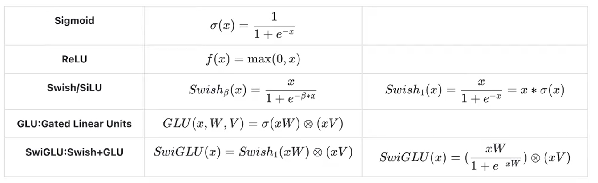
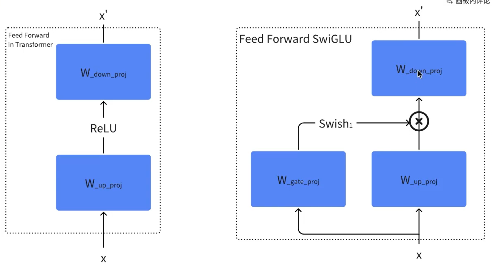

## 3. 模型构建



实现一个名为 **MiniMind** 的自定义语言模型（LLM）。从架构上看，它高度参考了 **Llama** 的设计（RMSNorm, RoPE, SwiGLU），并集成了现代的前沿技术，特别是 **混合专家模型（MoE）** 和 **YaRN（RoPE 扩展算法）**。

以下是按模块划分的详细代码解读：

---

### 1. 配置类 (`MiniMindConfig`)

这是模型的蓝图，继承自 Hugging Face 的 `PretrainedConfig`。

*   **基础参数**：定义了 `vocab_size`（词表大小）、`hidden_size`（隐藏层维度）、`num_hidden_layers`（层数）等标准 Transformer 参数。
*   **RoPE 扩展 (YaRN)**：通过 `inference_rope_scaling` 开关，配置了 **YaRN** 算法。这是一种用于扩展上下文长度（Context Window）的技术，允许模型处理比训练时更长的序列。
*   **MoE 配置**：这是代码的亮点。
    *   `use_moe`: 是否开启混合专家。

具体参数含义，已在代码中给出了详细注释。

### 2. 基础组件

#### `RMSNorm`

*   Llama 系列模型标配的归一化层。比标准的 LayerNorm 少了减去均值的步骤，计算更简单，训练更稳定。

#### RoPE 位置编码 (`precompute_freqs_cis`, `apply_rotary_pos_emb`)

*   **旋转位置编码 (Rotary Positional Embeddings)**：通过旋转向量的方式注入位置信息。
*   **YaRN 实现**：在 `precompute_freqs_cis` 中，如果检测到 `rope_scaling`，会根据 YaRN 论文的公式调整频率（`beta_fast`, `beta_slow` 等参数），从而支持外推（Extrapolation）更长的文本长度。

这段代码实现了现代大语言模型（LLM）中两个最核心的组件：**RMSNorm（均方根层归一化）** 和 **RoPE（旋转位置编码）**，其中 RoPE 部分还集成了 **YaRN** 算法以支持长文本外推。

下面我将分模块详细解释代码逻辑，并补充必要的数学公式。

---

### 1. RMSNorm (Root Mean Square Layer Normalization)

这是目前 LLaMA、DeepSeek 等主流模型使用的归一化层。与标准的 LayerNorm 相比，RMSNorm 去掉了“减去均值”的操作，计算更简单，且在训练深层网络时效果相当甚至更好。

```python
class RMSNorm(torch.nn.Module):
    def __init__(self, dim: int, eps: float = 1e-5):
        super().__init__()
        self.eps = eps
        # 可学习的缩放参数 gamma (weight)
        self.weight = nn.Parameter(torch.ones(dim))

    def _norm(self, x):
        # rsqrt 是 1/sqrt(x)
        # pow(2).mean(-1) 计算 x^2 的均值
        return x * torch.rsqrt(x.pow(2).mean(-1, keepdim=True) + self.eps)

    def forward(self, x):
        # 强制转为 float32 计算 norm 以保证数值精度，最后再转回 x 的类型 (如 float16)
        return self.weight * self._norm(x.float()).type_as(x)
```

#### 📘 核心公式解释

**标准 LayerNorm 公式：**
$$\bar{x} = \frac{x - \mu}{\sigma} \cdot \gamma + \beta$$
需要计算均值 $\mu$ 和方差 $\sigma$。



**RMSNorm 公式：**
RMSNorm 假设输入的均值趋近于 0，因此省略了 $\mu$ 和偏置 $\beta$：
$$\bar{x} = \frac{x}{\text{RMS}(x)} \cdot \gamma$$
其中均方根（RMS）计算如下：
$$\text{RMS}(x) = \sqrt{\frac{1}{n} \sum_{i=1}^{n} x_i^2 + \epsilon}$$

*   **代码对应**：
    *   `x.pow(2).mean(-1)` 对应 $\frac{1}{n} \sum x_i^2$。
    *   `torch.rsqrt(...)` 对应 $\frac{1}{\sqrt{\dots}}$。
    *   `self.weight` 对应 $\gamma$。

---

### 2. RoPE 与 YaRN (预计算频率)

函数 `precompute_freqs_cis` 用于预先计算旋转位置编码所需的 Cos 和 Sin 矩阵。这里包含了一个高级特性：**YaRN (Yet another RoPE extensioN)**，用于在推理时动态扩展模型的上下文窗口（Extrapolation）。

```python
def precompute_freqs_cis(dim: int, end: int = int(32 * 1024), rope_base: float = 1e6,
                         rope_scaling: Optional[dict] = None):
    # 1. 基础频率计算 (Theta)
    # dim 是 head_dim (hidden_size // num_heads)
    # 这里的切片 [: (dim // 2)] 是因为 RoPE 是成对旋转的
    freqs = 1.0 / (rope_base ** (torch.arange(0, dim, 2)[: (dim // 2)].float() / dim))
    
    # 2. YaRN 算法 (长文本外推逻辑)
    if rope_scaling is not None:
        # 获取配置参数
        orig_max = rope_scaling.get("original_max_position_embeddings", 2048) # 训练时的最大长度
        factor = rope_scaling.get("factor", 4)       # 扩展倍数
        beta_fast = rope_scaling.get("beta_fast", 4.0)
        beta_slow = rope_scaling.get("beta_slow", 1.0)
        
        # 仅当推理长度 end 超过训练长度 orig_max 时触发
        if end / orig_max > 1.0:
            # 寻找高频和低频的分界点 corr_dim
            corr_dim = next((i for i in range(dim // 2) if 2 * math.pi / freqs[i] > orig_max), dim // 2)
            
            # 计算插值斜坡 (Ramp function)
            power = torch.arange(0, dim // 2, device=freqs.device).float() / max(dim // 2 - 1, 1)
            beta = beta_slow + (beta_fast - beta_slow) * power
            
            # YaRN 缩放公式
            # 对高频分量（dim 较小部分）不怎么缩放，对低频分量（dim 较大部分）进行强缩放
            scale = torch.where(torch.arange(dim // 2, device=freqs.device) < corr_dim, 
                                (beta * factor - beta + 1) / (beta * factor), 
                                1.0 / factor)
            freqs = freqs * scale # 修正频率

    # 3. 生成位置编码
    t = torch.arange(end, device=freqs.device)
    # 外积：生成 [seq_len, dim//2] 的角度矩阵 theta * position
    freqs = torch.outer(t, freqs).float()
    
    # 4. 拼接 Cos 和 Sin
    # 注意：这里拼接了两次，是为了适配下面的 rotate_half 实现
    # 形状变为 [seq_len, dim]
    freqs_cos = torch.cat([torch.cos(freqs), torch.cos(freqs)], dim=-1)
    freqs_sin = torch.cat([torch.sin(freqs), torch.sin(freqs)], dim=-1)
    return freqs_cos, freqs_sin
```

#### 📘 核心公式解释

1. **RoPE 基础频率 $\theta_i$**：
   $$\theta_i = 10000^{-2i/d}$$
   代码中 `rope_base` 默认为 100万 (`1e6`)，这通常用于支持超长上下文（CodeLlama 做法）。

2. **YaRN (NTK-aware Interpolation 的改进)**：

   - <font color=red>minimind 代码实现的似乎并不是标准的 YaRN，但是原理也是高频保留，低频插值，中间平滑</font>
     当需要推理的长度超过训练长度时，直接外推会导致 Attention 崩坏。YaRN 通过修改频率 $\theta$ 来解决这个问题。

   *   它将维度分为三部分：高频部分（不插值）、低频部分（线性插值）、中间部分（平滑过渡）。
   *   代码中的 `scale` 变量即为修正因子 $\lambda$。
   *   通过 `freqs = freqs * scale`，实际上是减小了旋转的速度，使得位置 $L_{new}$ 的旋转角度看起来像是在 $L_{train}$ 范围内，从而“欺骗”模型。

#### YaRN 公式推导

参考知乎(这篇讲的真的不错):https://zhuanlan.zhihu.com/p/1944715652926538312

##### 1. 基础：RoPE 的定义回顾

首先回顾旋转位置编码（Rotary Positional Embedding, RoPE）的标准形式。
对于维度 $d$ 的查询向量 $x$（假设 $d$ 为偶数），在位置 $m$ 的 RoPE 变换可以表示为复数形式：

$$f(x, m) = x \cdot e^{i m \theta_d}$$

其中 $\theta_d$ 是第 $d$ 个维度的旋转频率（Base Frequency）：

$$\theta_d = b^{-2d/|D|}$$

*   $b$：基数，通常为 10000。
*   $|D|$：Head 的维度大小。
*   $d \in [0, |D|/2)$。

与之对应的**波长（Wavelength）** $\lambda_d$ 为：

$$\lambda_d = \frac{2\pi}{\theta_d} = 2\pi b^{2d/|D|}$$

##### 2. 问题：为什么要改进？

当我们将上下文窗口从 $L_{train}$ 扩展到 $L_{test}$ 时（设扩展倍数 $s = L_{test} / L_{train} > 1$）：

1.  **线性插值 (PI)**：将位置索引 $m$ 替换为 $m/s$。这等价于将所有频率缩小 $s$ 倍。
    *   *问题*：对于高频维度（$d$ 较小，波长 $\lambda$ 短），插值会导致旋转极其缓慢，破坏了模型对“局部位置关系”的感知，导致性能骤降。
2.  **NTK-Aware**：通过改变基数 $b$ 来隐式调整频率。
    *   *问题*：虽然比 PI 好，但无法精准控制哪些维度该插值、哪些该外推。

##### 3. YaRN 的核心推导：基于波长的分段策略

YaRN 的核心思想是：**“不同维度的波长对插值的敏感度不同”**。

*   **高频（短波长）**：负责局部关注，不应该被拉伸（应保持外推，Extrapolation）。
*   **低频（长波长）**：负责全局关注，必须被拉伸以覆盖更长的序列（应进行插值，Interpolation）。

YaRN 引入了一个**Ramp 函数（斜坡函数）** 来平滑混合这两种策略。

###### 3.1 定义插值权重 $\alpha_d$

YaRN 定义了两个阈值 $\beta_{fast}$ 和 $\beta_{slow}$，用于判断当前维度 $d$ 的波长 $\lambda_d$ 相对于训练长度 $L_{train}$ 的关系。

令 $r_d = \frac{L_{train}}{\lambda_d}$ 表示训练长度内包含的周期数。

根据 YaRN 论文，我们定义一个分段线性函数（Ramp Function）$\alpha_d$ 来决定插值的程度：

$$
\alpha_d = \text{ramp}\left(\frac{r_d - \beta_{slow}}{\beta_{fast} - \beta_{slow}}\right)
$$

其中 $\text{ramp}(x)$ 将值截断在 $[0, 1]$ 之间：
$$
\text{ramp}(x) = \begin{cases}
0 & \text{if } x < 0 \\
x & \text{if } 0 \le x \le 1 \\
1 & \text{if } x > 1
\end{cases}
$$

**直观解释：**

*   **$\alpha_d = 0$ (低频/长波长)**：当 $r_d$ 很小（波长很长，超过了上下文），我们需要完全的线性插值来防止位置编码“转完一圈”导致混淆。
*   **$\alpha_d = 1$ (高频/短波长)**：当 $r_d$ 很大（波长很短，旋转很快），我们不需要插值，保持原样（外推）即可，因为高频旋转具有很强的相对位置抗性。
*   **$0 < \alpha_d < 1$ (中频)**：进行平滑过渡。

*(注：论文中具体实现通常使用波长 $\lambda$ 与 $L_{train}$ 的比值作为判断依据，具体 $\beta$ 值通常通过实验测定，如 $\beta_{fast}=32, \beta_{slow}=1$)*

###### 3.2 计算 YaRN 修正后的频率

我们根据 $\alpha_d$ 对扩展倍数 $s$ 进行平滑混合，得到第 $d$ 维度的实际缩放因子 $s_d$：

$$s_d = (1 - \alpha_d) \cdot s + \alpha_d \cdot 1$$

*   如果 $\alpha_d = 1$（高频），$s_d = 1$（不缩放）。
*   如果 $\alpha_d = 0$（低频），$s_d = s$（完全按 $s$ 缩放，即线性插值）。

最终，YaRN 修改后的频率 $\theta_d^{YaRN}$ 为：

$$
\theta_d^{YaRN} = \frac{\theta_d}{s_d} = \theta_d \cdot \frac{1}{(1 - \alpha_d) s + \alpha_d}
$$

在位置 $m$ 的编码变为 $e^{i m \theta_d^{YaRN}}$。

---

##### 4. 动态扩展 (Dynamic YaRN)

上述推导是静态的（预先设定好 $s$）。所谓的**动态扩展（Dynamic Scaling）**，是指在推理过程中，当输入序列长度 $L_{current}$ 超过训练长度 $L_{train}$ 时，自动调整 $s$。

**推导如下：**

在每次前向传播时，计算当前的缩放比例：

$$s = \max\left(1, \frac{L_{current}}{L_{train}}\right)$$

然后将这个 $s$ 代入上述 **3.2** 节的公式中计算 $\theta_d^{YaRN}$。
这意味着：

1.  当 $L_{current} \le L_{train}$ 时，$s=1$，退化为标准 RoPE。
2.  当 $L_{current} > L_{train}$ 时，根据当前长度动态计算插值强度。

---

##### 5. 关键补充：Attention Logits 的温度修正 (Length Scaling)

YaRN 的推导中还有一个极其重要的步骤。仅仅修改频率会导致长序列下 Attention 分布的“熵”发生变化（注意力变得过于分散或尖锐）。为了保持注意力分数的分布与未扩展时一致，YaRN 引入了一个温度系数 $\sqrt{t}$。

**推导逻辑：**
RoPE 的点积性质受到频率缩放的影响。为了抵消这种影响，需要对 Attention Logits 进行缩放：

$$\text{Attention}(Q, K) = \text{softmax}\left(\frac{Q K^T}{\sqrt{|D|} \cdot t}\right)$$

其中 $t$ 通常取值为：

$$t \approx 0.1 \ln(s) + 1$$

或者在实现中直接对 RoPE 后的向量乘以 $\sqrt{1/t}$。这个系数保证了扩展上下文后，Perplexity（困惑度）不会因为注意力稀释而恶化。

---

#### 精简：YaRN 完整公式

1.  **确定缩放倍数**：$s = \frac{L_{new}}{L_{train}}$。
2.  **计算频率混合权重**：

$$\lambda_d = \frac{2\pi}{\theta_d} = 2\pi b^{2d/|D|}$$
$$\alpha_d = \text{ramp}\left(\frac{\frac{L_{train}}{\lambda_d} - \beta_{slow}}{\beta_{fast} - \beta_{slow}}\right)$$

$$
\text{ramp}(x) = \begin{cases}
0 & \text{if } x < 0 \\
x & \text{if } 0 \le x \le 1 \\
1 & \text{if } x > 1
\end{cases}
$$

3.  **计算新频率**：
    $$\theta_d' = \theta_d \cdot \left( (1-\alpha_d) s + \alpha_d \right)^{-1}$$
4.  **应用 RoPE**：
    $$f_{YaRN}(x, m) = x e^{i m \theta_d'}$$
5.  **应用温度修正**：
    $$\text{Scale factor} = \sqrt{0.1 \ln(s) + 1}$$
    $$\text{Logits} = \frac{Q K^T}{\sqrt{D}} \times \frac{1}{\text{Scale factor}^2}$$
    这就是 YaRN 能够实现“几乎无损”且“无需微调”（或仅需少量微调）即可动态扩展上下文长度的数学原理。

---

### 3. 应用 RoPE (旋转操作)

函数 `apply_rotary_pos_emb` 将计算好的 Cos 和 Sin 应用到 Query 和 Key 向量上。

```python
def apply_rotary_pos_emb(q, k, cos, sin, position_ids=None, unsqueeze_dim=1):
    # 辅助函数：将向量切分为两半，并交换顺序、取负
    # [x1, x2] -> [-x2, x1]
    def rotate_half(x):
        return torch.cat((-x[..., x.shape[-1] // 2:], x[..., : x.shape[-1] // 2]), dim=-1)

    # 应用欧拉公式的实数形式
    # q_embed = q * cos + rotate_half(q) * sin
    q_embed = (q * cos.unsqueeze(unsqueeze_dim)) + (rotate_half(q) * sin.unsqueeze(unsqueeze_dim))
    k_embed = (k * cos.unsqueeze(unsqueeze_dim)) + (rotate_half(k) * sin.unsqueeze(unsqueeze_dim))
    return q_embed, k_embed
```

#### 📘 核心公式解释

RoPE 的核心思想是将位置 $m$ 编码为复数域的旋转。对于二维向量 $(x_1, x_2)$，旋转 $\theta$ 角度后的结果 $(x'_1, x'_2)$ 为：

$$
\begin{pmatrix} x'_1 \\ x'_2 \end{pmatrix} = \begin{pmatrix} \cos m\theta & -\sin m\theta \\ \sin m\theta & \cos m\theta \end{pmatrix} \begin{pmatrix} x_1 \\ x_2 \end{pmatrix}
$$

展开后得到：
$$x'_1 = x_1 \cos m\theta - x_2 \sin m\theta$$
$$x'_2 = x_2 \cos m\theta + x_1 \sin m\theta$$

**对应代码逻辑：**

代码中的向量并不是两两交错排列 $(x_1, x_2, x_3, x_4)$，而是将前半部分作为 $x_1$ 组，后半部分作为 $x_2$ 组（即 `dim // 2` 切分）。

1.  **`q * cos`**:
    *   前半部分：$x_1 \cos \theta$
    *   后半部分：$x_2 \cos \theta$

2.  **`rotate_half(q)`**:
    *   输入：$[x_{front}, x_{back}]$ 即 $[x_1, x_2]$
    *   输出：$[-x_{back}, x_{front}]$ 即 $[-x_2, x_1]$

3.  **`rotate_half(q) * sin`**:
    *   前半部分：$-x_2 \sin \theta$
    *   后半部分：$x_1 \sin \theta$

4.  **相加 (`q_embed`)**:
    *   **前半部分结果**：$x_1 \cos \theta - x_2 \sin \theta$ （完美匹配 $x'_1$ 公式）
    *   **后半部分结果**：$x_2 \cos \theta + x_1 \sin \theta$ （完美匹配 $x'_2$ 公式）

### 总结

*   **RMSNorm**：为了更快的计算速度和更好的收敛性，去除了均值计算。
*   **precompute_freqs_cis**：生成了旋转所需的角度，并利用 **YaRN** 算法动态调整频率，使得模型可以在不经过微调的情况下，推理比训练时更长的文本。
*   **apply_rotary_pos_emb**：利用巧妙的向量切片和拼接 (`rotate_half`)，高效地实现了旋转矩阵乘法，完成了相对位置信息的注入。

### 3. 注意力机制 (`Attention`)

*   **GQA (Grouped Query Attention)**：通过 `num_key_value_heads` 控制。如果 KV heads 数量小于 Attention heads，则多个 Query 共享一组 KV，节省显存并加速推理。
*   **Flash Attention**：检查 PyTorch 版本，如果支持则使用 `F.scaled_dot_product_attention` 进行硬件加速。
*   **KV Cache**：支持 `past_key_value`，用于自回归生成时的加速（只计算新 Token，复用历史计算结果）。

### 4. 前馈网络与混合专家 (FFN & MoE)

这是代码中最复杂的部分，分为普通 FFN 和 MoE FFN。

#### `FeedForward` (普通 FFN)

*   标准的 **SwiGLU** 结构：包含 `gate_proj`, `up_proj`, `down_proj` 三个线性层。激活函数为 SiLU。
    这段代码实现了 Transformer 模型中常用的 **“门控前馈网络（Gated Feed-Forward Network）”**，是 MiniMind 模型（类 LLaMA 架构）的核心组件之一。其核心特点是引入“门控机制”（通过两个线性层的乘积控制特征流动），相比传统的单路径前馈网络，能更高效地捕捉特征依赖，同时通过维度调整和激活函数引入非线性。

我们从 **类结构、初始化逻辑、前向传播、关键设计细节** 四部分逐步解析：


##### 一、类基础信息

```python
class FeedForward(nn.Module):
```

- 继承自 `torch.nn.Module`（PyTorch 中所有神经网络模块的基类），必须实现 `__init__`（初始化）和 `forward`（前向传播）方法。
- 功能：对输入张量进行“升维-非线性变换-降维”的映射，同时通过门控机制筛选有效特征。


##### 二、`__init__` 初始化方法（核心配置与层定义）

`__init__` 方法的作用是：根据模型配置（`config`）初始化网络层，确定各层的输入/输出维度、激活函数、dropout 概率等。

###### 1. 输入参数

- `config: MiniMindConfig`：自定义的模型配置类，包含关键超参数（如 `hidden_size`、`intermediate_size` 等），类似 Hugging Face 模型的 `Config` 类。

###### 2. 中间层维度（`intermediate_size`）计算

```python
if config.intermediate_size is None:
    intermediate_size = int(config.hidden_size * 8 / 3)
    config.intermediate_size = 64 * ((intermediate_size + 64 - 1) // 64)
```

这是类 LLaMA 架构的经典设计，目的是**自动计算合理的中间层维度，并确保其是 64 的整数倍**（适配硬件并行计算，提升效率）：

- `config.intermediate_size`：前馈网络“中间升维层”的维度（若用户未指定，则自动计算）；
- 计算逻辑拆解：
  1. 基础计算：`hidden_size * 8 / 3` → 中间层维度约为隐藏层维度的 2.67 倍（平衡性能与计算量）；
  2. 对齐 64 的整数倍：`64 * ((x + 64 - 1) // 64)` → 等价于“向上取整到最近的 64 的倍数”（例如 x=100 → (100+63)//64=2 → 2×64=128）。
- 示例：若 `hidden_size=768` → 基础中间维度=768×8/3=2048 → 2048 已是 64 的倍数（2048÷64=32），故 `intermediate_size=2048`。

###### 3. 核心网络层定义（`nn.Linear` 线性层）

```python
self.gate_proj = nn.Linear(config.hidden_size, config.intermediate_size, bias=False)
self.down_proj = nn.Linear(config.intermediate_size, config.hidden_size, bias=False)
self.up_proj = nn.Linear(config.hidden_size, config.intermediate_size, bias=False)
```

三个线性层（`nn.Linear` 即全连接层）构成门控前馈网络的核心，均设置 `bias=False`（类 LLaMA 设计，减少计算量且不影响性能）：

| 层名        | 输入维度            | 输出维度            | 作用                                       |
| ----------- | ------------------- | ------------------- | ------------------------------------------ |
| `gate_proj` | `hidden_size`       | `intermediate_size` | 门控投影：生成“门控信号”，控制特征通过比例 |
| `up_proj`   | `hidden_size`       | `intermediate_size` | 升维投影：将输入升维到中间层维度           |
| `down_proj` | `intermediate_size` | `hidden_size`       | 降维投影：将中间层特征降维回隐藏层维度     |

###### 4. 正则化与激活函数

```python
self.dropout = nn.Dropout(config.dropout)
self.act_fn = ACT2FN[config.hidden_act]
```

- `nn.Dropout`：随机失活层，概率为 `config.dropout`（防止过拟合，默认通常为 0.1）；
- `ACT2FN`：激活函数映射字典（需提前定义，如 `ACT2FN = {"swish": torch.nn.functional.silu, "gelu": torch.nn.functional.gelu}`），根据 `config.hidden_act` 选择激活函数（类 LLaMA 常用 `silu`（SwiGLU）激活）。


##### 三、`forward` 前向传播方法（核心计算逻辑）

```python
def forward(self, x):
    return self.dropout(self.down_proj(self.act_fn(self.gate_proj(x)) * self.up_proj(x)))
```

这是门控前馈网络的核心计算流程，输入 `x` 是形状为 `[batch_size, seq_len, hidden_size]` 的张量（批次×序列长度×隐藏层维度），输出形状与输入一致（`[batch_size, seq_len, hidden_size]`）。

我们按计算顺序拆解步骤（结合维度变化，假设 `hidden_size=768`，`intermediate_size=2048`）：

###### 步骤 1：门控投影（`gate_proj(x)`）

```python
self.gate_proj(x)  # 维度：[B, L, 768] → [B, L, 2048]
```

将输入 `x` 从隐藏层维度（768）投影到中间层维度（2048），生成“门控信号”（控制后续特征的通过权限）。

###### 步骤 2：激活函数（`self.act_fn(...)`）

```python
self.act_fn(self.gate_proj(x))  # 维度保持 [B, L, 2048]
```

对门控信号应用非线性激活函数（如 `silu`），将门控信号映射到 (0,1) 附近（模拟“开关”效果：值越接近 1，允许越多特征通过；值越接近 0，屏蔽越多特征）。

###### 步骤 3：升维投影（`self.up_proj(x)`）

```python
self.up_proj(x)  # 维度：[B, L, 768] → [B, L, 2048]
```

将原始输入 `x` 直接升维到中间层维度（2048），得到“原始特征的升维版本”（未经过门控筛选）。

###### 步骤 4：门控相乘（`act(gate) * up(x)`）

```python
self.act_fn(self.gate_proj(x)) * self.up_proj(x)  # 维度保持 [B, L, 2048]
```

**核心门控操作**：逐元素相乘（element-wise product）。  
门控信号（经过激活）与升维后的原始特征相乘，实现“特征筛选”：只有门控信号允许（值较大）的位置，原始特征才能保留并传递下去。

###### 步骤 5：降维投影（`down_proj(...)`）

```python
self.down_proj(...)  # 维度：[B, L, 2048] → [B, L, 768]
```

将经过门控筛选后的中间层特征（2048 维）降维回原始隐藏层维度（768 维），完成“升维-筛选-降维”的闭环。

###### 步骤 6：dropout 正则化（`self.dropout(...)`）

```python
self.dropout(...)  # 维度保持 [B, L, 768]
```

对降维后的特征随机失活部分神经元，防止模型过拟合，提升泛化能力。

###### 最终输出

输出形状与输入 `x` 完全一致（`[batch_size, seq_len, hidden_size]`），可直接作为下一层（如注意力层、归一化层）的输入。


##### 四、关键设计细节与对比

###### 1. 与传统前馈网络（FFN）的区别

传统 Transformer 的前馈网络是“单路径”结构：

```python
# 传统 FFN（无门控）
x → up_proj(x) → act(...) → down_proj(x) → dropout
```

而本实现是“双路径门控”结构：

```python
# 门控 FFN（本代码）
x → gate_proj(x) → act(...) → [与 up_proj(x) 相乘] → down_proj(x) → dropout
```

核心优势：通过门控信号动态筛选有效特征，减少冗余信息传递，提升模型表达能力和效率。

###### 2. 类 LLaMA 的关键设计

- 无偏置（`bias=False`）：减少参数数量和计算量，类 LLaMA 实证表明不影响性能；
- 中间层维度计算（`hidden_size * 8/3` + 64 对齐）：平衡计算效率和模型容量；
- 激活函数（通常为 `silu`）：SwiGLU 激活（`silu(gate) * up(x)`）的特例，是类 LLaMA 架构的标准配置。

###### 3. 维度兼容性

输入 `x` 必须是 3 维张量（`[batch_size, seq_len, hidden_size]`），若为其他维度（如 2 维 `[batch_size, hidden_size]`），可通过 `unsqueeze(1)` 插入序列维度后使用，输出需对应 `squeeze(1)` 还原。

#### `MoEGate` (门控机制)

*   **功能**：决定每个 Token 应该交给哪些专家处理。
*   **评分**：使用 `Softmax` 计算 Token 对每个专家的亲和度分数。
*   **Top-K**：选出分数最高的 K 个专家。
*   **辅助损失 (Aux Loss)**：为了防止“专家负载不均衡”（即某些专家累死，某些闲死），计算了一个 `aux_loss`，在训练时加入总 Loss 中，强迫数据均匀分配给各个专家。

#### `MOEFeedForward` (MoE FFN)

*   **架构**：
    *   `self.experts`: 路由专家列表（多个 FeedForward）。
    *   `self.shared_experts`: 共享专家列表（总是被激活）。
*   **前向传播逻辑**：
    1.  **共享专家**：输入直接通过共享专家，计算结果作为基底。
    2.  **路由专家**：
        *   **训练时**：为了并行效率，通常会复制输入并按掩码计算。
        *   **推理时 (`moe_infer`)**：代码手动实现了一个循环，根据索引将 Token 分发给对应的专家计算，然后再加权聚合回来。
    3.  **结果融合**：输出 = 共享专家输出 + Σ(路由专家输出 * 权重)。

### 5. 模型主体结构

#### `MiniMindBlock` (Transformer 层)

*   标准的 Transformer 结构：
    1.  Input -> RMSNorm -> Attention -> Residual Add.
    2.  Input -> RMSNorm -> **MLP (可能是普通 FFN 或 MoE)** -> Residual Add.

#### `MiniMindModel` (编码器主体)

*   包含 `Embedding` 层。
*   堆叠多个 `MiniMindBlock`。
*   包含最终的 `RMSNorm`。
*   **预计算 RoPE**：在初始化时预先算好位置编码的 cos/sin 表。
*   **Aux Loss 收集**：在 forward 结束时，将所有层的 MoE 负载均衡 Loss 加起来返回。

#### `MiniMindForCausalLM` (顶层封装)

*   **任务**：因果语言模型（Causal LM），即“预测下一个词”。
*   **Head**：包含一个 `lm_head` 线性层，将隐藏状态映射回词表维度 (`vocab_size`)。
*   **权重绑定 (Weight Tying)**：`self.model.embed_tokens.weight = self.lm_head.weight`。这意味着 Embedding 层和输出层共享权重矩阵，这在小模型中常见，能显著减少参数量并防止过拟合。

### 总结：MiniMind 的特点

1.  **麻雀虽小，五脏俱全**：虽然叫 MiniMind，但它包含了 Llama 架构的核心（RoPE, RMSNorm, SwiGLU）。
2.  **先进的 MoE 架构**：采用了类似 DeepSeek 的 **Shared + Routed Experts** 策略，这比原始的 Switch Transformer 更先进，能更好地保持知识连贯性。
3.  **长文本支持**：原生集成了 **YaRN** 缩放，支持超出训练长度的推理。
4.  **推理优化**：支持 KV Cache 和 Flash Attention，支持 GQA，保证了推理速度。


这段代码非常适合作为一个学习现代 LLM 架构（尤其是 MoE）的微型参考实现。
