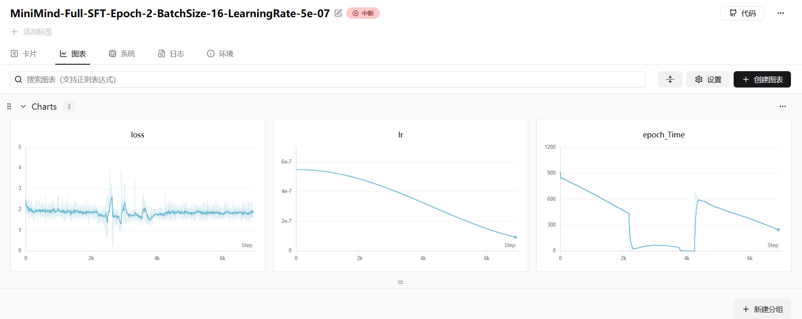

## 5. SFT

训练模型多轮对话能力，代码与pretrain基本一致，加载的数据不同，使用了多轮对话模板。

### 多轮对话模板

`dataset/lm_dataset.py` 中的 `class SFTDataset(Dataset)`

这段代码实现了一个自定义的 PyTorch `Dataset` 类，名为 `SFTDataset`。它的核心作用是将**原始的对话数据**（JSONL 格式）转换成**模型可以训练的 Tensor 格式**。

其中最关键、最复杂的部分是**如何构建 Mask（掩码）**。在 SFT（有监督微调）中，我们**通常只希望计算模型“回答”部分的 Loss**，而不计算“提问/Prompt”部分的 Loss。

下面我通过一个具体的例子，一步步演示数据在代码中的变化过程。

---

#### 1. 假设输入数据与环境

假设我们有一条训练数据（JSONL 中的一行）：
```json
{
  "conversations": [
    {"role": "user", "content": "1+1=?"},
    {"role": "assistant", "content": "2"}
  ]
}
```

假设 Tokenizer（分词器）的特殊 Token 定义如下（为了简化，用数字代替 ID）：
*   `<s>` (BOS, 开始): ID `1`
*   `</s>` (EOS, 结束): ID `2`
*   `assistant`: ID `20`
*   `user`: ID `10`
*   `1+1=?`: IDs `[101, 102, 103]`
*   `2`: ID `200`
*   填充 (Pad): ID `0`

---

#### 2. 代码逐行执行流程

##### 步骤 A: 初始化 (`__init__`)

```python
self.bos_id = tokenizer(f'{tokenizer.bos_token}assistant', ...).input_ids 
self.eos_id = tokenizer(f'{tokenizer.eos_token}', ...).input_ids 
```
*   这里代码预先计算了“助手回复开始”的标志。
*   假设 `tokenizer.bos_token` 是 `<s>`。
*   `self.bos_id` 对应的就是 `<s>assistant` 的 ID 序列，例如：`[1, 20]`。
*   `self.eos_id` 对应的就是 `</s>` 的 ID 序列，例如：`[2]`。

##### 步骤 B: 处理单条数据 (`__getitem__`)

当 `dataloader` 请求一个数据样本时，`__getitem__` 被调用。

**1. 构建文本 Prompt (`_create_chat_prompt`)**

```python
prompt = self._create_chat_prompt(sample['conversations'])
```
*   这一步使用 `apply_chat_template` 将对话列表拼接成一个字符串。
*   **Prompt 变化**：
    *   输入：`[{"role": "user"...}, {"role": "assistant"...}]`
    *   输出字符串（假设格式）：`<s>user\n1+1=?</s><s>assistant\n2</s>`

**2. Token 化与填充**

```python
input_ids = self.tokenizer(prompt).input_ids[:self.max_length]
input_ids += [self.tokenizer.pad_token_id] * (...)
```
*   将字符串转为 ID 列表，并用 0 填充到最大长度。
*   **input_ids 变化**：
    *   `[1, 10, 101, 102, 103, 2, 1, 20, 200, 2, 0, 0, ...]`
    *   对应含义：`<s>` `user` `1+1=?` `</s>` `<s>` `assistant` `2` `</s>` `pad`...

**3. 生成 Loss Mask (`_generate_loss_mask`) —— *核心难点***
```python
loss_mask = self._generate_loss_mask(input_ids)
```
这个函数的目标是：**只保留“助手回复”部分的 Loss，屏蔽“用户提问”和“特殊标记头”的 Loss。**

让我们模拟循环过程（目标是寻找 `[1, 20]` 开始，`[2]` 结束的片段）：

*   **初始状态**：`loss_mask` 全为 0。 `i = 0`。
*   **循环扫描**：
    *   `i=0`: ID是 `1`。检查 `input_ids[0:2]` 是 `[1, 10]`，不等于 `[1, 20]`。 -> `i` 加 1。
    *   ... (跳过 user 部分) ...
    *   `i=6`: ID是 `1`。检查 `input_ids[6:8]` 是 `[1, 20]`。**匹配成功！** (这是 `<s> assistant`)
*   **确定回复范围**：
    *   `start = 6 + 2 = 8` (指向回复内容的开始，即 ID `200` 对应的位置)。
    *   从 `start` 开始找 `eos_id` (`[2]`)。
    *   在索引 `9` 找到了 `2` (即 `</s>`)。 -> `end = 9`。
*   **填充 Mask**：
    *   代码逻辑：`range(start + 1, end + len(eos) + 1)`
    *   Wait, 这里的代码逻辑 `start + 1` 是个很巧妙（或者说需要注意）的设计。通常我们希望预测的是“下一个token”。
    *   这里它将 `loss_mask` 对应的位置设为 1。
    *   **结果**：它标记了 **回复内容** 以及 **结束符** 的位置。
*   **更新 i**：`i` 跳到 `end + len(eos)`，继续寻找下一轮对话（如果是多轮对话）。

**4. 构建最终训练数据 (X, Y, Mask)**
```python
X = torch.tensor(input_ids[:-1], dtype=torch.long)
Y = torch.tensor(input_ids[1:], dtype=torch.long)
loss_mask = torch.tensor(loss_mask[1:], dtype=torch.long)
```
这是自回归语言模型（如 GPT）的标准操作：**Next Token Prediction**。

*   **X (输入)**: 去掉最后一个 Token。
    *   `[1, 10, ..., 1, 20, 200, 2, 0, ...]` (去掉最后一个0)
*   **Y (标签)**: 去掉第一个 Token (整体左移一位)。
    *   `[10, ..., 1, 20, 200, 2, 0, 0, ...]`
    *   解释：输入 `<s>` 预测 `user`；输入 `assistant` 预测 `2`。

*   **Mask 对齐**: `loss_mask` 也取 `[1:]`。
    *   这步非常重要。因为 `loss_mask` 原本是对应 `input_ids` 的。
    *   现在我们的目标是 `Y`。
    *   如果 `loss_mask` 在“2”这个位置是 1，意味着我们需要计算“预测 2”这个行为的 Loss。
    *   “预测 2”是由输入中的“assistant”触发的。

---

#### 3. 图解变化总结

| 步骤       | 内容 / Token 含义 | ID 序列 (简化示例) | Mask (初始) | Mask (移位后) | 说明                                   |
| :--------- | :---------------- | :----------------- | :---------- | :------------ | :------------------------------------- |
| **Input**  | `<s>`             | 1                  | 0           | -             | 输入开头，不预测                       |
| **Input**  | `user`            | 10                 | 0           | 0             | prompt 部分，不计算 Loss               |
| **Input**  | `1+1=?`           | 101...             | 0           | 0             | prompt 部分                            |
| **Input**  | `</s>`            | 2                  | 0           | 0             | prompt 结束                            |
| **Input**  | `<s>`             | 1                  | 0           | 0             | 助手回复引导头                         |
| **Input**  | `assistant`       | 20                 | 0           | **1**         | **关键点**：输入 assistant，预测下一词 |
| **Target** | `2` (回答)        | 200                | **1**       | **1**         | 希望模型学会输出 2                     |
| **Target** | `</s>`            | 2                  | **1**       | 0             | 希望模型学会停止                       |
| **Pad**    | `pad`             | 0                  | 0           | 0             | 填充无意义                             |

**注意代码中的细节：**
`loss_mask` 的生成逻辑中 `range(start + 1, ...)` 结合最后的 `loss_mask[1:]` 实际上是在控制：**让模型在看到“assistant”之后，开始计算 Loss，直到预测完结束符。**

---

#### 4. 为什么这么做？

1.  **SFT 的本质**：我们只希望模型模仿 Assistant 的说话方式，而不希望模型去学习 User 是怎么提问的（那是预训练学的事）。如果把 User 的 Prompt 也算入 Loss，模型可能会“跑偏”，或者 Loss 难以收敛。
2.  **动态匹配**：通过 `_generate_loss_mask` 动态查找 `bos_id` 和 `eos_id`，使得该代码可以处理**多轮对话**。如果有多个 `user -> assistant` 的回合，代码会把每一轮 assistant 的回复都标为 Mask=1。
3.  **移位操作 (Shift)**：
    *   `X` 是 `t` 时刻的输入。
    *   `Y` 是 `t+1` 时刻的真值。
    *   Mask 必须与 `Y` 对齐，告诉 Loss 函数：在计算 `Y` 的某些位置的 CrossEntropy 时，乘以 1（计算），其他位置乘以 0（忽略）。


### 实验结果

