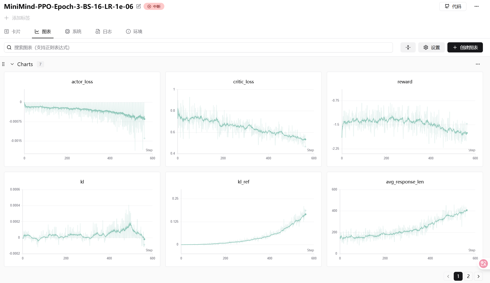

## 7. PPO

`train_ppo.py` 脚本的主要目的是利用 RLHF (Reinforcement Learning from Human Feedback) 或 RLAIF (AI Feedback) 的思想，优化大语言模型的生成策略，使其更符合人类偏好（通过 Reward Model 评分）以及特定的格式要求（如推理模型的思考标签）。

下面我将分模块详细解析代码逻辑，并结合 PPO 的数学公式进行推导说明。

---

### 1. 核心架构与模型角色

在 PPO 训练中，通常涉及 4 个主要模型（脚本中也是如此）：

1.  **Actor Model (`actor_model`)**:
    *   **角色**: 正在训练的策略网络 $\pi_\theta$。
    *   **作用**: 接收 Prompt，生成 Response。我们需要优化它的参数，使得生成的 Response 获得更高的奖励。
2.  **Critic Model (`critic_model`)**:
    *   **角色**: 价值网络 $V_\phi$。
    *   **代码定义**: 继承自 `MiniMindForCausalLM`，但将输出层 `lm_head` 替换为 `nn.Linear(hidden_size, 1)`。
    *   **作用**: 估计当前状态（输入序列）的预期价值（Value），用于计算优势函数（Advantage）。
3.  **Reference Model (`ref_model`)**:
    *   **角色**: 参考模型 $\pi_{ref}$（通常是 SFT 后的模型）。
    *   **作用**: 固定参数不训练。用于计算 KL 散度，防止 Actor 跑偏（Reward Hacking），保持语言生成的流畅性。
4.  **Reward Model (`reward_model`)**:
    *   **角色**: 奖励模型 $R$（这里使用的是 `internlm2-1_8b-reward`）。
    *   **作用**: 给 Actor 生成的 Response 打分。

---

### 2. 奖励计算 (`calculate_rewards`)

这是 RLHF 的核心信号来源。脚本中的奖励由两部分组成：**规则奖励** 和 **模型奖励**。

$$R(s, a) = R_{format} + R_{model}$$

#### A. 规则奖励 (Format Reward)

针对推理模型（`args.reasoning == 1`），代码强制要求输出包含 `<think>...</think><answer>...</answer>` 结构。

*   **正则匹配**: 如果完全匹配结构，奖励 +0.5。
*   **标记奖励**: 每出现一个标签（如 `<think>`），奖励 +0.25。
*   **目的**: 解决强化学习初期模型容易丢失特定格式的问题（Alignment Tax）。

#### B. 模型奖励 (Model Reward)

使用预训练好的 Reward Model 对生成的文本进行打分。

*   **普通打分**: 将 Prompt + Response 输入 Reward Model 得到分数。
*   **推理内容加权**: 如果是推理模型，脚本会将 `<answer>` 标签内的内容单独拿出来再打一次分，并按 `0.4 * 全文分 + 0.6 * 答案分` 进行加权。这强迫模型不仅要推理过程好，最终答案也要好。

---

### 3. PPO 训练循环 (`ppo_train_epoch`)

这是代码最核心的部分。我们将按照执行顺序结合 PPO 公式进行解析。

#### Step 1: 采样 (Rollout)

```python
gen_out = model_for_gen.generate(...)
```

*   **逻辑**: Actor 根据 Prompt 生成 Response。
*   **数学**: 从当前策略 $\pi_\theta$ 中采样轨迹 $\tau = (s, a)$。

<font color=red>关于采样用 actor_model 而不是 old_actor_model 的一些思考</font>

这是一个关于 **On-Policy（同策略）** 算法实现的经典问题。

##### 详细分析

**结论：**
在绝大多数现代 RLHF（如 DeepSpeed-Chat, TRL）和本脚本的实现逻辑中，使用 **`actor_model`（当前策略）** 是更合适、更标准的做法。

虽然从严格的 PPO 数学推导来看存在一点细微的争议，但使用 `actor_model` 是为了保证**采样效率**和**策略迭代的有效性**。

###### 1. 为什么选 `actor_model`（当前策略）？

**理由 A：强化学习的目标是优化当前策略**
PPO 是一个 On-Policy 算法，它的核心假设是：我们正在优化 $\pi_\theta$，并且我们需要使用 $\pi_\theta$ 产生的样本来评估当前的梯度方向。

*   如果我们使用 `old_actor_model` 采样，我们在让模型去学习“旧策略产生的行为”。
*   如果我们使用 `actor_model` 采样，我们在让模型学习“**自己当前产生的行为**”。这能更直接地反馈当前参数的好坏。

**理由 B：防止分布偏移 (Distribution Shift)**
随着训练进行，`actor_model` 的能力会逐渐强于 `old_actor_model`（因为后者是滞后更新的）。
如果一直用落后的 `old_actor` 采样，`actor` 实际上是在优化那些它自己可能已经不会再去走的路径（Trajectories），这会降低训练效率。

###### 2. 代码中的数学矛盾与妥协

你可能注意到了一个数学上的不一致性：

*   **PPO 公式**: Ratio $r_t(\theta) = \frac{\pi_{new}(a|s)}{\pi_{old}(a|s)}$
*   **本脚本逻辑**:
    *   **分子** ($\pi_{new}$): 也就是代码中的 `actor_logp`，来自 `actor_model`。
    *   **分母** ($\pi_{old}$): 也就是代码中的 `old_logp`，来自 `old_actor_model`。
    *   **数据来源**: 来自 `actor_model`。

**这里的问题在于：**
严格的 PPO 要求 **“分母对应的模型”必须是“产生数据的模型”**。
即：如果你用 `actor_model` 采样，那么初始的 Ratio 应该是 $\frac{\pi_{actor}}{\pi_{actor}} = 1$。
但代码中，分母用的是 `old_actor`，所以初始 Ratio 是 $\frac{\pi_{actor}}{\pi_{old\_actor}}$，这可能不等于 1。

**为什么即使这样，依然推荐用 `actor_model`？**
这是 **Rolling Update PPO**（滚动更新 PPO）的一种常见工程实现。

1.  **Clipping 机制兜底**: PPO 的 `torch.clamp(ratio, 1-eps, 1+eps)` 会自动处理 Ratio 偏离 1 过远的情况。如果 `actor` 和 `old_actor` 差异太大，Clipping 会限制梯度的更新幅度，防止模型崩溃。
2.  **更新频率 (`update_old_actor_freq`)**: 脚本中设定了每隔几步就同步一次 `old_actor`。这意味着它们之间的差异通常很小，上述的数学误差在可接受范围内。

###### 3. 什么是标准工业界做法？

在 **DeepSpeed-Chat** 或 **HuggingFace TRL** 中，流程通常是这样的（更严谨的做法）：

1.  使用 `actor_model` 生成数据。
2.  **立刻**（在反向传播前）在这个数据上计算一遍 `log_probs`，并将其作为 `old_log_probs` 固定下来（detach）。
3.  进入训练循环，计算新的 `log_probs`，计算 Ratio。

这种做法既保证了使用当前策略采样，又保证了 Ratio 初始值为 1。

**但针对你当前的脚本：**
由于脚本采用了“滞后网络 (`old_actor_model`)”来计算分母，而不是“即时计算并缓存 log_probs”，**使用 `actor_model` 采样是权衡后的最佳选择**。

*   如果你用 `old_actor_model` 采样：Ratio 初始确实为 1（数学正确），但你在优化旧策略的数据，训练会变慢。
*   如果你用 `actor_model` 采样：Ratio 初始不完全为 1，但 Clip 会处理它，且你在优化最新策略的数据（效率高）。


---


#### Step 2: 计算奖励与价值

```python
rewards = calculate_rewards(...) 
values_seq = critic_model(...)
values = values_seq[..., last_indices]
```

*   **逻辑**:
    1.  计算生成的 Response 的真实奖励 $R$。
    2.  Critic 预测该序列的价值 $V(s)$。注意这里只取了序列最后一个 token 的 value 作为整句的价值估计。

#### Step 3: 计算优势函数 (Advantage Estimation)

```python
advantages = rewards - values.detach()
```

*   **数学推导**:
    PPO 需要评估当前动作比“平均情况”好多少。
    通常使用 GAE (Generalized Advantage Estimation)，但本脚本使用了简化版（类似于 Contextual Bandit 的处理方式）：
    $$A(s, a) = R(s, a) - V_\phi(s)$$
    这里 $R$ 是实际获得的奖励，$V$ 是 Critic 预测的基线。
    *   如果 $A > 0$: 说明生成的比预期好，要增加该动作的概率。
    *   如果 $A < 0$: 说明生成的比预期差，要降低该动作的概率。

#### Step 4: 计算对数概率 (Log Probabilities)

为了计算 PPO 的损失函数，我们需要三个概率值：

1.  **当前策略概率** (`actor_logp`): $\log \pi_\theta(a|s)$
2.  **旧策略概率** (`old_logp`): $\log \pi_{\theta_{old}}(a|s)$
3.  **参考策略概率** (`ref_logp`): $\log \pi_{ref}(a|s)$

代码中使用 `gather` 操作提取生成 token 对应的 logit 值。

#### Step 5: 计算损失函数 (Loss Function)

PPO 的总 Loss 通常由三部分组成：
$$L^{total} = L^{CLIP} - c_1 L^{VF} + c_2 L^{KL}$$
*(注意：PyTorch 是最小化 Loss，而 RL 通常是最大化奖励，所以符号方向取决于具体实现，这里我们讨论最小化视角)*

##### 1. 策略损失 (Policy Loss / CLIP Loss)

```python
ratio = torch.exp(actor_logp - old_logp)  # pi_theta / pi_theta_old
surr1 = ratio * advantages
surr2 = torch.clamp(ratio, 1.0 - eps, 1.0 + eps) * advantages
policy_loss = -torch.min(surr1, surr2).mean()
```

*   **数学公式**:
    $$r_t(\theta) = \frac{\pi_\theta(a_t|s_t)}{\pi_{\theta_{old}}(a_t|s_t)}$$
    $$L^{CLIP}(\theta) = -\hat{\mathbb{E}}_t \left[ \min(r_t(\theta)\hat{A}_t, \text{clip}(r_t(\theta), 1-\epsilon, 1+\epsilon)\hat{A}_t) \right]$$
*   **解释**:
    *   `ratio`: 新旧策略的比率。
    *   `clip`: 限制比率在 $[1-\epsilon, 1+\epsilon]$ 之间（通常 $\epsilon=0.1$ 或 $0.2$）。
    *   **核心思想**: 允许策略更新，但不能一次更新太大（Trust Region），防止策略崩溃。

##### 2. 价值损失 (Value Function Loss)

```python
value_loss = F.mse_loss(values, rewards)
```

*   **数学公式**:
    $$L^{VF} = (V_\phi(s_t) - R_t)^2$$
*   **解释**: 训练 Critic 模型，使其预测的价值 $V$ 越来越接近真实的奖励 $R$，从而让优势函数 $A$ 的估计更准确。

##### 3. KL 散度惩罚 (KL Penalty)

```python
kl_ref = (actor_logp - ref_logp).mean()
loss = ... + args.kl_coef * kl_ref
```

*   **数学公式**:
    $$L^{KL} = \beta \cdot D_{KL}(\pi_\theta || \pi_{ref})$$
    近似计算为: $\log \pi_\theta(a|s) - \log \pi_{ref}(a|s)$
*   **解释**: 惩罚 Actor 偏离 Reference Model 太远。如果没有这一项，Actor 可能会为了高分输出乱码（Reward Hacking）。

###### KL 近似求解推导

这是一个非常棒的数学原理问题。你敏锐地发现了**理论定义**（积分或求和）与**代码实现**（简单的减法）之间的差异。

简单来说，代码中的写法利用了 **Monte Carlo 采样（蒙特卡洛采样）** 来近似计算 KL 散度，利用了对数的性质简化运算。

下面我分三步详细推导。

---

**1. KL 散度的标准定义公式**

对于两个离散概率分布 $P$（当前策略 $\pi_\theta$）和 $Q$（参考策略 $\pi_{ref}$），KL 散度（Kullback-Leibler Divergence）的标准定义是：

$$ D_{KL}(P || Q) = \sum_{x \in \mathcal{X}} P(x) \log \frac{P(x)}{Q(x)} $$

或者写成期望（Expectation）的形式：

$$ D_{KL}(P || Q) = \mathbb{E}_{x \sim P} \left[ \log \frac{P(x)}{Q(x)} \right] $$

**这里的含义是：**
我们要遍历词表 $\mathcal{X}$ 中**所有的词**（例如 50000 个 token），计算它们的概率差，然后加权求和。

---

**2. 为什么代码里变成了简单的减法？**

代码中的公式：
$$ \text{kl\_val} = \log \pi_\theta(a|s) - \log \pi_{ref}(a|s) $$

这是基于以下两个数学步骤推导出来的：

* <font color=blue>第一步：利用对数性质展开</font>
  根据对数除法变减法的性质 $\log(\frac{A}{B}) = \log A - \log B$，标准公式内部的项变成：

$$ \log \frac{\pi_\theta(a|s)}{\pi_{ref}(a|s)} = \log \pi_\theta(a|s) - \log \pi_{ref}(a|s) $$

这正是代码中 `actor_logp - ref_logp` 的来源。

* <font color=blue>第二步：蒙特卡洛采样 (Monte Carlo Approximation)</font>
  **这是最关键的一步。**

在训练大语言模型时，词表非常大（比如 3万~10万）。对于生成的每一个步骤，我们**不可能**去遍历所有可能的 token 来计算上面的求和公式 $\sum P(x) \dots$。

但是，我们生成的 `gen_out` 本身就是根据当前策略 $\pi_\theta$ **采样（Sample）** 出来的样本。

根据大数定律，我们可以用**样本的平均值**来估计**总体的期望值**：

$$ D_{KL}(\pi_\theta || \pi_{ref}) = \mathbb{E}_{a \sim \pi_\theta} \left[ \log \frac{\pi_\theta(a|s)}{\pi_{ref}(a|s)} \right] \approx \frac{1}{N} \sum_{i=1}^{N} \left( \log \pi_\theta(a_i|s_i) - \log \pi_{ref}(a_i|s_i) \right) $$

**对应代码逻辑：**

1.  **采样**：`gen_out` 是从 $\pi_\theta$ 采样出来的动作序列。
2.  **计算单点差异**：`actor_logp - ref_logp` 计算了当前这条路径上每个点的对数概率差。
3.  **求均值**：代码最后用了 `.mean()`。

```python
# 理论公式中的 log(P/Q)
kl_per_token = actor_logp - ref_logp 

# 理论公式中的 Expectation E[...]
kl_ref = kl_per_token.mean() 
```

所以，这实际上是 **KL 散度的无偏估计量（Unbiased Estimator）**。

---

**3. 直观理解**

*   **$\log \pi_\theta(a|s)$**：当前模型对这个词的自信程度。
*   **$\log \pi_{ref}(a|s)$**：参考模型（原版模型）对这个词的自信程度。

$$ \text{Diff} = \text{Current Confidence} - \text{Ref Confidence} $$

*   如果 `Diff > 0`：说明当前模型比原模型更倾向于说这个词。这意味着模型发生偏移了，KL 变大，Loss 增加（惩罚）。
*   如果 `Diff < 0`：说明当前模型比原模型更不敢说这个词。
*   通过最小化这个差值的均值，我们限制了 $\pi_\theta$ 不要离 $\pi_{ref}$ 太远，防止模型为了刷高分（Reward Hacking）而输出原本完全不会说的乱码。

**总结**

代码中的写法：
$$ \log \pi_\theta - \log \pi_{ref} $$
并不是一个错误的“近似”，而是 KL 散度定义中 **对数项的展开**，配合 batch **平均值** 后，它就是 KL 散度期望值的**蒙特卡洛估计**。

这样做既避免了全词表遍历的巨大计算量，又能准确反映分布之间的距离。

#### Step 6: 梯度更新与旧策略更新

* **梯度累积**: `loss.backward()` 后，每隔 `accumulation_steps` 更新一次权重。

* **Old Actor 更新**:

  ```python
  if (step + 1) % args.update_old_actor_freq == 0:
      # load state dict from actor to old_actor
  ```

  这是一个非标准的 PPO 实现细节。标准 PPO 通常在收集一批数据后，在一个内部循环中训练 K 个 epoch，期间 $\pi_{old}$ 不变。而这个脚本采用了 **Rolling Update** 的方式：每隔几步将当前的 Actor 复制给 Old Actor。这意味着它是一种近似的 Online PPO。

---

### 4. 关键参数解析

*   `--vf_coef` (0.5): 价值损失在总损失中的权重。
*   `--kl_coef` (0.02): KL 散度惩罚的系数。系数越大，模型越保守，越贴近原模型。
*   `--clip_epsilon` (0.1): PPO 裁剪范围，限制策略更新幅度。
*   `--reasoning` (1): 决定是否启用特定于推理模型（Thinking process）的格式奖励。

### 5. 总结

这个脚本实现了一个**端到端的 PPO 训练流程**：

1.  **Actor** 生成数据。
2.  **Critic** 评估价值。
3.  **Reward Model** 提供外部反馈。
4.  通过 **PPO Clip Loss** 保证训练稳定性。
5.  通过 **KL Loss** 保证生成分布不崩坏。
6.  通过 **自定义格式奖励** 强化模型的推理结构。

这种实现方式比较轻量级，适合在 MiniMind 这种小参数模型上进行 RLHF 实验。

### 实验结果

