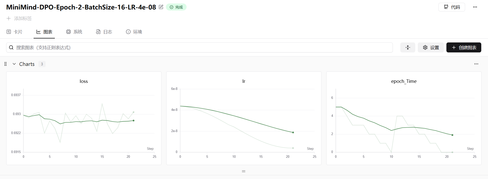

## 8. DPO

这段代码实现的是 **DPO (Direct Preference Optimization, 直接偏好优化)** 的损失函数。

DPO 的核心目标是让模型（Policy）在“优选回复（Chosen）”上的概率比“拒绝回复（Rejected）”更高，同时通过 $\beta$ 参数约束模型不要偏离参考模型（Reference Model）太远。

以下是结合代码逻辑与数学公式的详细解析：

### 1. 核心逻辑分步解析

#### 第一步：长度归一化 (Length Normalization)

```python
seq_lengths = mask.sum(dim=1, keepdim=True).clamp_min(1e-8)
ref_log_probs = (ref_log_probs * mask).sum(dim=1) / seq_lengths.squeeze()
policy_log_probs = (policy_log_probs * mask).sum(dim=1) / seq_lengths.squeeze()
```

**解释：**
标准的 DPO 通常使用的是句子总的 Log Probability（即所有 token 的对数概率之和）。但这段代码做了一个**特殊处理**：它除以了序列长度 `seq_lengths`。

*   **数学含义：** 计算的是**平均**对数概率（Average Log Probability），而非总和。
*   **目的：** 为了消除长短句带来的数值差异，防止模型因为句子长短不一而产生偏差（例如避免模型仅仅因为句子长、累积的数值大而产生错误的梯度）。

对应公式为：
$$ \log P(y|x) \approx \frac{1}{T} \sum_{i=1}^{T} \log P(y_i | x, y_{<i}) $$

#### 第二步：数据切分 (Splitting Chosen/Rejected)

```python
batch_size = ref_log_probs.shape[0]
chosen_ref_log_probs = ref_log_probs[:batch_size // 2]
reject_ref_log_probs = ref_log_probs[batch_size // 2:]
# ... policy 同理
```

**解释：**
这里假设输入的 `batch` 是拼接好的。前半部分（`0 ~ batch//2`）是人类偏好的数据（Chosen, $y_w$），后半部分（`batch//2 ~ end`）是人类拒绝的数据（Rejected, $y_l$）。它们是一一对应的成对数据。

#### 第三步：计算相对 Log 差值 (Log Ratios)

```python
pi_logratios = chosen_policy_log_probs - reject_policy_log_probs
ref_logratios = chosen_ref_log_probs - reject_ref_log_probs
logits = pi_logratios - ref_logratios
```

**解释：**
DPO 的核心在于比较 Policy 模型和 Reference 模型对“好坏样本”的区分度。

*   `pi_logratios`: 当前模型认为“好样本”比“坏样本”好多少（对数概率差）。
*   `ref_logratios`: 参考模型认为“好样本”比“坏样本”好多少。
*   `logits`: 当前模型相对于参考模型的“优势提升”。

数学公式表达如下：
$$ \text{logits} = \underbrace{\left( \log \pi_\theta(y_w|x) - \log \pi_\theta(y_l|x) \right)}_{\text{Policy 偏好程度}} - \underbrace{\left( \log \pi_{ref}(y_w|x) - \log \pi_{ref}(y_l|x) \right)}_{\text{Reference 偏好程度}} $$
*(注：代码中的 $\log \pi$ 实际上是经过长度归一化后的值)*

我们也可以将其重写为 DPO 论文中更常见的形式（将 $y_w$ 和 $y_l$ 分组）：
$$ \text{logits} = \log \frac{\pi_\theta(y_w|x)}{\pi_{ref}(y_w|x)} - \log \frac{\pi_\theta(y_l|x)}{\pi_{ref}(y_l|x)} $$

#### 第四步：计算损失 (Loss Calculation)

```python
loss = -F.logsigmoid(beta * logits)
return loss.mean()
```

**解释：**
这是标准的 DPO 损失形式。$\beta$ 是超参数，控制 KL 散度的惩罚力度（即控制当前模型偏离参考模型的程度）。`logsigmoid` 是 $\log(\frac{1}{1+e^{-x}})$。

---

### 2. 数学公式总结

该函数的完整数学表达式如下：

给定输入 $x$，优选回复 $y_w$，拒绝回复 $y_l$，以及对应的序列有效长度 $T_w$ 和 $T_l$。

该代码实现的损失函数 $\mathcal{L}_{DPO}$ 为：

$$
\mathcal{L}_{DPO}(\pi_\theta; \pi_{ref}) = - \mathbb{E}_{(x, y_w, y_l) \sim D} \left[ \log \sigma \left( \beta \cdot \Delta \right) \right]
$$

其中 $\Delta$ (代码中的 `logits`) 计算如下：

$$
\Delta = \left( \frac{1}{T_w}\sum \log \pi_\theta(y_w) - \frac{1}{T_l}\sum \log \pi_\theta(y_l) \right) - \left( \frac{1}{T_w}\sum \log \pi_{ref}(y_w) - \frac{1}{T_l}\sum \log \pi_{ref}(y_l) \right)
$$

### 3. 与原版 DPO 的区别

原版 DPO 论文（Rafailov et al.）中的公式通常**没有除以序列长度**：

$$
\text{Standard DPO: } \log \frac{\pi_\theta(y)}{ \pi_{ref}(y)} = \sum \log \pi_\theta(y_i) - \sum \log \pi_{ref}(y_i)
$$

**代码中的改动点：**
代码中增加了 `/ seq_lengths.squeeze()`。
这是一个工程上的 trick（在 `minimind` 项目及其他一些实现中常见）。如果 $y_w$ 很长而 $y_l$ 很短，不除以长度的话，累加的 log probability 会因为长度本身产生巨大的数值差异，可能导致训练不稳定。**除以长度后，模型优化的是“平均每个 token 的置信度”，而非“整句的置信度”。** 

### 实验结果

