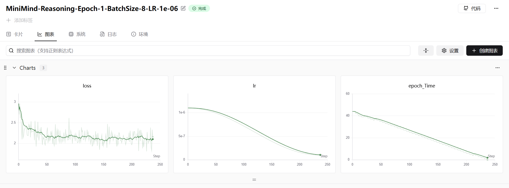

## 9. 白盒蒸馏

### 9.1 Distillation Loss

**知识蒸馏（Knowledge Distillation, KD）** 中的核心部分——**蒸馏损失（Distillation Loss）**。

具体来说，它计算了学生模型（Student）和教师模型（Teacher）在经过温度（Temperature, $T$）软化后的输出分布之间的 **Kullback-Leibler (KL) 散度**，并按 $T^2$ 进行了缩放。

以下是详细的数学公式解释和代码逻辑分析。

---

#### 1. 数学公式解释

假设：

*   $z_s$：学生模型的原始输出（Logits）。
*   $z_t$：教师模型的原始输出（Logits）。
*   $T$：蒸馏温度（Temperature）。
*   $N$：类别的数量。

#### 第一步：软化概率分布 (Soft Softmax)

代码对应：`student_logits / temperature` 和 `log_softmax`。

为了让学生模型学习到教师模型的“暗知识”（Dark Knowledge，即非正确类别的概率关系），我们需要将输出分布变得平滑。公式如下：

学生模型的软化概率（对数形式）：
$$
\log(q_i^{\tau}) = \log\left( \frac{\exp(z_{s,i} / T)}{\sum_{j=1}^N \exp(z_{s,j} / T)} \right)
$$

教师模型的软化概率（假设 `teacher_probs` 已经经过了同样的 $T$ 处理）：
$$
p_i^{\tau} = \frac{\exp(z_{t,i} / T)}{\sum_{j=1}^N \exp(z_{t,j} / T)}
$$

#### 第二步：KL 散度 (KL Divergence)

代码对应：`F.kl_div(student_log_probs, teacher_probs, ...)`。

KL 散度用于衡量两个概率分布的差异。在 PyTorch 中，`F.kl_div` 接受的第一个参数是**对数概率**，第二个参数是**概率**。数学公式为：

$$
D_{KL}(p^{\tau} || q^{\tau}) = \sum_{i=1}^N p_i^{\tau} \cdot \left( \log(p_i^{\tau}) - \log(q_i^{\tau}) \right)
$$

*   $p^{\tau}$：教师分布（Target/True）。
*   $q^{\tau}$：学生分布（Input/Pred）。
*   注意：在深度学习优化中，由于教师分布 $p^{\tau}$ 是固定的，$\sum p \log p$ 是常数，所以优化 KL 散度等价于优化交叉熵 $H(p, q) = -\sum p \log q$。

#### 第三步：温度缩放 (Scaling)

代码对应：`return (temperature ** 2) * kl`。

最终的蒸馏损失函数为：

$$
L_{KD} = T^2 \cdot D_{KL}(p^{\tau} || q^{\tau})
$$

---

#### 2. 代码逐行解析

1.  **`student_log_probs = F.log_softmax(student_logits / temperature, dim=-1)`**
    *   **操作**：先将学生的 logits 除以 $T$，然后进行 Log-Softmax。
    *   **原因**：PyTorch 的 `F.kl_div` 函数要求**输入（input）必须是对数概率（log-probabilities）**，而不是普通概率。这是为了数值稳定性。

2.  **`kl = F.kl_div(student_log_probs, teacher_probs, reduction=reduction)`**
    *   **输入**：
        *   `student_log_probs`: 学生的对数软化概率 ($\log q^{\tau}$)。
        *   `teacher_probs`: 教师的软化概率 ($p^{\tau}$)。**注意：**这里假设传入的 `teacher_probs` 已经通过了 `softmax(teacher_logits / temperature)` 处理。
    *   **计算**：计算两者之间的散度。

3.  **`return (temperature ** 2) * kl`**
    *   **操作**：将计算出的 KL 散度乘以 $T^2$。
    *   **核心原因（重点）**：
        *   当我们使用温度 $T$ 进行软化时，Softmax 的梯度幅值会大约按 $1/T^2$ 的比例缩小。
        *   如果不乘 $T^2$，当 $T$ 很大时，蒸馏损失的梯度会非常小，导致其相对于“硬标签损失”（Hard Label Loss，通常是 CrossEntropy）的影响力几乎为零。
        *   乘以 $T^2$ 可以让蒸馏损失的梯度量级与硬标签损失保持在同一个量级，便于调参和训练。

这段代码展示了一个**包含知识蒸馏（Knowledge Distillation）和混合专家模型（MoE）支持的训练步骤（Training Step）**。

它的核心目标是：不仅让学生模型（Student）学习真实的标签（Ground-Truth），还要让它模仿教师模型（Teacher）的输出概率分布。

以下是代码的逐段详细解析和背后的数学逻辑：

---

### 9.2 完整的Loss

整个训练步的损失函数 $L_{total}$ 可以表示为：

$$
L_{total} = \alpha \cdot L_{CE} + (1 - \alpha) \cdot L_{KD} + \mathbb{I}_{MoE} \cdot L_{aux}
$$

其中：

1. **交叉熵损失 (CE)**：
   $$
   L_{CE} = - \frac{1}{M} \sum_{k \in \text{valid}} \log P_{\text{student}}(y_k | x_k)
   $$
   （$M$ 是有效 mask 的 token 数量）

2. **蒸馏损失 (KD)**：
   $$
   L_{KD} = T^2 \cdot D_{KL} \left( \sigma\left(\frac{z_{\text{teacher}}}{T}\right) \bigg\| \sigma\left(\frac{z_{\text{student}}}{T}\right) \right)
   $$
   （只在有效 mask 的位置计算）

3. **最终权重**：
   代码逻辑实际上是：
   `Total = (alpha * CE + (1-alpha) * KD) + Aux`
   *(注意：代码中 aux_loss 是直接加在 ce_loss 上的，所以 aux_loss 实际上也被 alpha 加权了，这可能是一个实现上的细节，取决于 `res.aux_loss` 的具体量级)*。

### 9.3 蒸馏Reasoning模型

核心逻辑在于：在标准的交叉熵损失（CrossEntropy Loss）基础上，对**特殊的推理标签**（如 `<think>`, `</think>`, `<answer>` 等）进行了**加权处理**，迫使模型更精准地预测这些控制思维链（Chain of Thought）起止的特殊Token。

以下是结合**张量（向量）维度变化**的详细逐行解释：

---

#### 1. 维度定义与前置准备

为了方便解释，假设我们有以下维度参数：

*   **$B$ (Batch Size)**: 批次大小，例如 4。
*   **$T$ (Sequence Length)**: 序列长度，例如 1024。
*   **$V$ (Vocab Size)**: 词表大小，例如 32000。

```python
loss_fct = nn.CrossEntropyLoss(reduction='none')
```

*   **关键点**：`reduction='none'`。
*   通常 CrossEntropyLoss 会直接返回标量（平均值），但这里我们需要对每个 Token 单独加权，所以必须设为 `'none'`，让它返回每个位置的 Loss。

---

#### 2. 前向传播与基础 Loss 计算

```python
res = model(X)
loss = loss_fct(
    res.logits.view(-1, res.logits.size(-1)),
    Y.view(-1)
).view(Y.size())
```

**维度演变分析：**

1.  **输入 $X$**: 维度 `[B, T]`。
2.  **模型输出 `res.logits`**: 维度 `[B, T, V]`。模型预测每个位置是词表中每个词的概率。
3.  **变形 `res.logits.view(-1, V)`**:
    *   为了计算 Loss，需要把 Batch 和 Sequence 维度展平。
    *   维度变为 `[B * T, V]`。 (例如 `[4096, 32000]`)。
4.  **目标 `Y.view(-1)`**:
    *   对应的标签也展平。
    *   维度变为 `[B * T]`。 (例如 `[4096]`)。
5.  **计算 Loss**:
    *   `loss_fct` 计算展平后每个 Token 的交叉熵。
    *   输出维度 `[B * T]`。
6.  **恢复形状 `.view(Y.size())`**:
    *   将 Loss 变回 `[B, T]`，保持 Batch 和序列结构，以便后续通过掩码（Mask）处理。
    *   **当前 `loss`**: 一个 `[B, T]` 的矩阵，存储了每个位置预测错误的程度。

---

#### 3. 核心逻辑：特殊标签加权（推理蒸馏特有）

这是这段代码的精髓。目的是让模型非常重视 `<think>` (思维开始) 和 `<answer>` (回答开始) 等结构化标签。

```python
sp_ids = torch.isin(Y.view(-1),
                    torch.tensor(start_of_think_ids + ...).to(args.device))
```

*   **动作**：判断 Target 中哪些位置是特殊标签。
*   **`Y.view(-1)`**: 维度 `[B * T]`。
*   **比较对象**: 一个包含几个特殊 ID 的短列表（如 `[101, 102, 103...]`）。
*   **`sp_ids`**: 维度 `[B * T]` 的 **布尔张量 (Boolean Tensor)**。
    *   如果是特殊标签，对应位置为 `True`，否则为 `False`。

```
loss_mask = loss_mask.view(-1)
loss_mask_sum = loss_mask.sum()
```

* **`loss_mask`**: 原始维度 `[B, T]`，通常用于屏蔽 Padding 或不需要计算 Loss 的部分（如 Prompt 部分）。其中有效部分为 1，无效部分为 0。

* **变形**: 变为 `[B * T]`。

* **`loss_mask_sum`**: 标量（Scalar）。表示当前 Batch 中**有效 Token 的总数**。注意，这里是在修改权重**之前**计算的，作为分母。

  ```python
  loss_mask[sp_ids] = 10  # 对思考标签增加10倍权重
  ```

```
*   **加权操作**：利用 `sp_ids` 作为索引。
*   在 `loss_mask` (`[B * T]`) 中，找到所有特殊标签的位置，将其原本的值（通常是 1.0）直接修改为 **10.0**。
*   **物理意义**：告诉模型，“预测错这个特殊标签的代价，是预测错普通单词代价的 10 倍”。
```python
loss_mask = loss_mask.view(Y.size())
loss = (loss * loss_mask).sum() / loss_mask_sum
```

*   **恢复形状**: `loss_mask` 变回 `[B, T]`。
*   **加权求和**:
    *   `loss` (`[B, T]`) 乘以 `loss_mask` (`[B, T]`)。
    *   普通 Token: $Loss_{token} \times 1$。
    *   特殊 Token: $Loss_{token} \times 10$。
    *   无效 Token: $Loss_{token} \times 0$。
*   **归一化**:
    *   `.sum()` 将所有 Loss 加起来。
    *   除以 `loss_mask_sum`（注意：分母是**未加权**的有效 Token 数量）。
    *   **策略分析**：这就不仅仅是“重采样”了，而是**梯度放大**。因为分子变大了（部分项乘以了10），分母却没变大。这相当于人为地调高了特殊标签位置的学习率，不仅改变了梯度的方向（更指向特殊标签），也增加了梯度的模长。

---

#### 4. 辅助 Loss 与 梯度缩放

```python
loss += res.aux_loss
loss = loss / args.accumulation_steps
scaler.scale(loss).backward()
```

*   **`aux_loss`**: 负载均衡损失，通常用于 MoE（混合专家模型）架构，防止某个专家过载。直接加在总 Loss 上。
*   **梯度累积**: 除以 `accumulation_steps`，用于显存不足时模拟大 Batch Size。
*   **混合精度训练**: `scaler.scale(loss)` 用于 float16/bfloat16 训练，防止梯度下溢。

#### 总结图示

假设一个简单的序列 `A -> <think> -> B` (Batch=1)：

| Token        | 原始 Loss | 原始 Mask | 是否特殊 | **修改后 Mask** |       **最终计算项**       |
| :----------- | :-------: | :-------: | :------: | :-------------: | :------------------------: |
| A            |    2.0    |    1.0    |  False   |       1.0       |    $2.0 \times 1 = 2.0$    |
| **\<think>** |  **3.0**  |  **1.0**  | **True** |    **10.0**     | **$3.0 \times 10 = 30.0$** |
| B            |    1.5    |    1.0    |  False   |       1.0       |    $1.5 \times 1 = 1.5$    |

*   **分子 (Sum)**: $2.0 + 30.0 + 1.5 = 33.5$
*   **分母 (Mask Sum)**: $1.0 + 1.0 + 1.0 = 3.0$ (注意分母还是3)
*   **最终 Loss**: $33.5 / 3 = 11.16$ (如果没有加权，应该是 $6.5 / 3 = 2.16$)

通过这种维度操作和掩码修改，代码实现了**强制模型学会何时开始思考、何时结束思考**的关键能力。


### 实验结果

